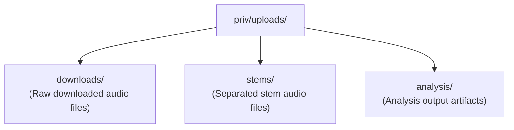
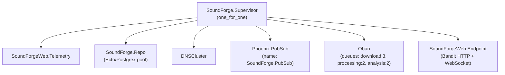

# System Overview

## Vision

Sound Forge Alchemy (SFA) is a port of the original Node.js/TypeScript Sound Forge Alchemy application to Elixir/OTP. The original system used Express.js, Redis-backed job queues, and Socket.IO for real-time updates. This rewrite targets Phoenix 1.8 with LiveView to gain the reliability, fault tolerance, and concurrency guarantees of the BEAM virtual machine -- properties that are essential for an application managing long-running audio processing pipelines.

The core workflow is: a user pastes a Spotify URL, the system fetches track metadata from the Spotify Web API, downloads the audio, separates it into individual stems (vocals, drums, bass, other) using Demucs, analyzes audio features (tempo, key, energy, spectral characteristics) using librosa, and displays all results in a real-time LiveView dashboard.

## High-Level Architecture

```mermaid
flowchart TD
    Browser["Browser Client\n(LiveView WebSocket +\nPhoenix Channel WS)"]

    subgraph WebLayer["SoundForgeWeb Layer"]
        DashboardLive["DashboardLive (LiveView)"]
        APIControllers["API Controllers"]
        JobChannel["JobChannel (WebSocket)"]
    end

    subgraph SpotifyCtx["SoundForge.Spotify (Context)"]
        URLParser["URLParser"]
        HTTPClient["HTTPClient"]
        ClientBhvr["Client (behaviour)"]
    end

    subgraph MusicCtx["SoundForge.Music (Context)"]
        Track["Track"]
        DownloadJob["DownloadJob"]
        ProcessingJob["ProcessingJob"]
        AnalysisJob["AnalysisJob"]
        Stem["Stem"]
        AnalysisResult["AnalysisResult"]
    end

    subgraph JobsCtx["SoundForge.Jobs.* (Contexts)"]
        JobsDownload["Download"]
        JobsProcessing["Processing"]
        JobsAnalysis["Analysis"]
    end

    Repo["SoundForge.Repo\n(Ecto/Postgres)"]
    SpotifyAPI["Spotify Web API\n(OAuth2 via Req)"]

    subgraph ObanJobs["Oban (Background Jobs)"]
        QueueDownload["download queue (3)"]
        QueueProcessing["processing queue (2)"]
        QueueAnalysis["analysis queue (2)"]
    end

    subgraph DemucsPort["Audio.DemucsPort (GenServer)"]
        DemucsErlang["Erlang Port → Python (Demucs)"]
    end
    subgraph AnalyzerPort["Audio.AnalyzerPort (GenServer)"]
        AnalyzerErlang["Erlang Port → Python (librosa)"]
    end

    demucs_runner["demucs_runner.py\n(htdemucs, htdemucs_ft,\nhtdemucs_6s, mdx_extra)"]
    analyzer_py["analyzer.py\n(tempo, key, energy,\nspectral, mfcc, chroma)"]

    subgraph Storage["SoundForge.Storage (Local Filesystem)"]
        StorageDownloads["priv/uploads/downloads/"]
        StorageStems["priv/uploads/stems/"]
        StorageAnalysis["priv/uploads/analysis/"]
    end

    subgraph PubSub["Phoenix.PubSub (Real-Time Event Bus)"]
        TopicTracks["\"tracks\" → DashboardLive"]
        TopicJobs["\"jobs:{id}\" → JobChannel + LiveView"]
    end

    Browser -->|"WebSocket (LiveView)\nWebSocket (JobChannel)\nHTTP (API endpoints)"| WebLayer
    WebLayer --> SpotifyCtx
    WebLayer --> MusicCtx
    WebLayer --> JobsCtx
    SpotifyCtx --> Repo
    MusicCtx --> Repo
    SpotifyCtx --> SpotifyAPI
    JobsCtx --> ObanJobs
    ObanJobs --> DemucsPort
    ObanJobs --> AnalyzerPort
    DemucsPort --> demucs_runner
    AnalyzerPort --> analyzer_py
```

## Component Overview

### Phoenix Web Layer (`SoundForgeWeb`)

The web layer serves two distinct interfaces:

**LiveView Interface** -- The primary user interface is a single-page LiveView application mounted at `/`. `DashboardLive` manages the main dashboard using Phoenix streams for efficient list rendering of tracks. It subscribes to PubSub topics for real-time updates when tracks are added or job progress changes. Supporting function components (`TrackCard`, `SpotifyInput`, `JobProgress`) decompose the UI into reusable pieces.

The admin interface is accessible to users with the `admin` or `platform_admin` role and provides system-wide statistics, user management, job monitoring, and audit logging.


*Admin Dashboard with the Overview tab active. The super_admin role badge is visible in the top-right corner. Tabs provide access to Users, Jobs, System, Analytics, Audit Log, and LLM provider management.*

**JSON API** -- A REST-style API under `/api` provides programmatic access to all operations. Four controllers handle the lifecycle:
- `SpotifyController` -- POST `/api/spotify/fetch` for metadata retrieval
- `DownloadController` -- POST `/api/download/track` and GET `/api/download/job/:id`
- `ProcessingController` -- POST `/api/processing/separate`, GET `/api/processing/job/:id`, GET `/api/processing/models`
- `AnalysisController` -- POST `/api/analysis/analyze` and GET `/api/analysis/job/:id`

**WebSocket Channel** -- `JobChannel` provides real-time job progress over a dedicated WebSocket. Clients join `"jobs:{job_id}"` and receive `job:progress`, `job:completed`, and `job:failed` events relayed from PubSub broadcasts.

### Ecto Data Layer (`SoundForge.Music`)

The `Music` context is the single source of truth for all domain data. It wraps six Ecto schemas -- `Track`, `DownloadJob`, `ProcessingJob`, `AnalysisJob`, `Stem`, and `AnalysisResult` -- providing standard CRUD operations through `SoundForge.Repo` backed by PostgreSQL. All schemas use `binary_id` primary keys for globally unique identifiers.

### Oban Background Jobs (`SoundForge.Jobs.*`)

Oban replaces the Redis-backed BullMQ job queue from the original TypeScript implementation. Three queues with controlled concurrency manage the processing pipeline:

| Queue | Concurrency | Purpose |
|-------|-------------|---------|
| `download` | 3 | Audio file downloads via `spotdl` |
| `processing` | 2 | Stem separation via Demucs (GPU-bound) |
| `analysis` | 2 | Audio feature extraction via librosa |

The `DownloadWorker` is the first implemented Oban worker. It uses the `spotdl` CLI tool to download audio from Spotify URLs, updates job status through the `Music` context, and broadcasts progress via PubSub:

```elixir
# From lib/sound_forge/jobs/download_worker.ex
use Oban.Worker,
  queue: :download,
  max_attempts: 3,
  priority: 1
```

Three context modules (`Jobs.Download`, `Jobs.Processing`, `Jobs.Analysis`) provide the orchestration layer between controllers and workers, handling job creation, track resolution, and Oban enqueuing.

### Erlang Ports to Python (`SoundForge.Audio.*`)

The computationally intensive audio work runs in Python processes managed through Erlang Ports. Two GenServer wrappers provide supervised communication:

**`Audio.AnalyzerPort`** -- Wraps `priv/python/analyzer.py` for librosa-based feature extraction. Supports feature selection (`tempo`, `key`, `energy`, `spectral`, `mfcc`, `chroma`, `all`) with a 2-minute timeout. Communication uses JSON over stdin/stdout.

**`Audio.DemucsPort`** -- Wraps `priv/python/demucs_runner.py` for stem separation. Supports model selection (`htdemucs`, `htdemucs_ft`, `mdx_extra`) with a 5-minute timeout. The port protocol uses newline-delimited JSON with three message types: `progress`, `result`, and `error`.

Both GenServers accumulate port data in a buffer, parse JSON on process exit (or on newline boundaries for DemucsPort), and reply to the calling process.

### Spotify Integration (`SoundForge.Spotify`)

Spotify integration uses a behaviour-based architecture for testability:

- `SoundForge.Spotify.Client` -- Behaviour defining `fetch_track/1`, `fetch_album/1`, `fetch_playlist/1` callbacks
- `SoundForge.Spotify.HTTPClient` -- Production implementation using Req with OAuth2 client credentials flow and ETS-based token caching (3500s TTL against Spotify's 3600s expiry)
- `SoundForge.Spotify.URLParser` -- Pure function module that extracts resource type and ID from Spotify URLs using a regex pattern that handles `open.spotify.com`, `spotify.com`, and international locale prefixes (`intl-xx`)

The client implementation is configurable via application env, defaulting to `HTTPClient` but swappable to `MockClient` in tests:

```elixir
# From lib/sound_forge/spotify.ex
defp spotify_client do
  Application.get_env(:sound_forge, :spotify_client, SoundForge.Spotify.HTTPClient)
end
```

### Storage (`SoundForge.Storage`)

Local filesystem storage organized under a configurable base path (default: `priv/uploads`):



## Data Flow

The complete pipeline for processing a Spotify track:

```mermaid
flowchart TD
    S1["1. USER INPUT\nUser pastes Spotify URL into SpotifyInput component"]
    S2["2. METADATA FETCH\nDashboardLive handle_event('fetch_spotify')\n→ SoundForge.Spotify.fetch_metadata(url)\n→ URLParser.parse(url) → {type: 'track', id: 'abc123'}\n→ HTTPClient.fetch_track('abc123') → Spotify Web API\n→ {:ok, %{'name' => '...', 'artists' => [...], ...}}"]
    S3["3. TRACK CREATION\nMusic.create_track(%{title: ..., artist: ..., spotify_url: ...})\n→ Repo.insert() → PostgreSQL"]
    S4["4. DOWNLOAD JOB\nJobs.Download.create_job(url)\n→ Music.create_download_job(%{track_id: track.id, status: :queued})\n→ DownloadWorker.new(args) |> Oban.insert()\n→ Oban picks up job from :download queue\n→ DownloadWorker.perform() → System.cmd('spotdl', [...])\n→ Music.update_download_job(job, %{status: :completed, output_path: path})\n→ PubSub.broadcast('jobs:{id}', {:job_progress, ...})"]
    S5["5. STEM SEPARATION\nJobs.Processing.create_separation_job(file_path, 'htdemucs')\n→ Music.create_processing_job(%{track_id: ..., model: 'htdemucs'})\n→ ProcessingWorker enqueued to :processing queue\n→ Audio.DemucsPort.separate(audio_path, model: 'htdemucs')\n→ Erlang Port → Python demucs_runner.py\n→ {vocals.wav, drums.wav, bass.wav, other.wav}\n→ Music.create_stem() for each stem\n→ PubSub.broadcast('jobs:{id}', {:job_progress, ...})"]
    S6["6. AUDIO ANALYSIS\nJobs.Analysis.create_job(file_path, 'full')\n→ Music.create_analysis_job(%{track_id: ..., status: :queued})\n→ AnalysisWorker enqueued to :analysis queue\n→ Audio.AnalyzerPort.analyze(audio_path, ['tempo', 'key', 'energy'])\n→ Erlang Port → Python analyzer.py (librosa)\n→ {tempo: 120.5, key: 'C major', energy: 0.75, ...}\n→ Music.create_analysis_result(%{track_id: ..., tempo: 120.5, ...})\n→ PubSub.broadcast('jobs:{id}', {:job_progress, ...})"]
    S7["7. REAL-TIME DISPLAY\nDashboardLive.handle_info({:job_progress, payload})\n→ assign(socket, :active_jobs, updated_jobs)\n→ LiveView re-renders JobProgress component\n\nJobChannel.handle_info({:job_completed, payload})\n→ push(socket, 'job:completed', payload)\n→ Browser JS receives event"]

    S1 --> S2 --> S3 --> S4 --> S5 --> S6 --> S7
```



## Technology Justifications

### Why Phoenix 1.8 and LiveView

The original application used Express.js with Socket.IO for real-time updates and React for the frontend. This architecture required maintaining separate WebSocket infrastructure, a Redis instance for pub/sub, and a React build pipeline. Phoenix provides all of this in a single framework:

- **LiveView** eliminates the need for a separate frontend framework. The dashboard updates in real-time over a single WebSocket connection with server-rendered HTML diffs. No JavaScript build step for UI logic.
- **PubSub** is built into Phoenix. Broadcasting job progress to the dashboard and to WebSocket channels requires zero external infrastructure -- no Redis pub/sub needed.
- **Channels** provide the WebSocket layer for non-LiveView clients (mobile apps, CLI tools) without additional dependencies.
- **Bandit** (HTTP server, configured in this project) runs on the BEAM scheduler, handling thousands of concurrent connections without a reverse proxy for WebSocket upgrades.

### Why Oban (Replaces Redis + BullMQ)

The original application used BullMQ on Redis for job queuing. Oban provides equivalent functionality using PostgreSQL as the backing store:

- **No Redis dependency** -- One fewer service to operate. The PostgreSQL database already required for Ecto serves double duty.
- **Transactional job insertion** -- Jobs are inserted in the same database transaction as the domain records they reference, preventing orphaned jobs.
- **Queue concurrency control** -- `download: 3, processing: 2, analysis: 2` limits resource consumption for each job type. Processing and analysis queues are limited to 2 because Demucs and librosa are CPU/GPU-intensive.
- **Built-in retry** -- `max_attempts: 3` on the `DownloadWorker` handles transient network failures automatically.
- **Oban.Pro** path available for future features like rate limiting, batch processing, and workflow orchestration if needed.

### Why Erlang Ports (Not NIFs)

Demucs (PyTorch-based stem separation) and librosa (NumPy/SciPy-based audio analysis) are mature Python libraries with no Elixir equivalents. The integration strategy uses Erlang Ports rather than NIFs or HTTP microservices:

- **Process isolation** -- A crashing Python process does not take down the BEAM VM. Port processes are OS-level separate processes. A segfault in PyTorch kills only the port, and the GenServer can detect it via `{:exit_status, code}`.
- **No C binding complexity** -- NIFs require careful memory management and can crash the entire VM. Audio processing operations are long-running (seconds to minutes), making them poor NIF candidates.
- **No network overhead** -- Unlike a separate Python microservice, Erlang Ports communicate via OS pipes (stdin/stdout), avoiding HTTP serialization overhead and network latency.
- **Supervised lifecycle** -- The `GenServer` wrappers (`AnalyzerPort`, `DemucsPort`) can be placed in the supervision tree, providing automatic restart on failure.

### Why a Single OTP Release

Sound Forge Alchemy is packaged as a single OTP release, not as microservices:

- **Operational simplicity** -- One deployment artifact. One process to monitor. One set of logs. No service mesh, no inter-service networking, no distributed tracing.
- **BEAM handles concurrency** -- The BEAM VM's preemptive scheduler manages thousands of lightweight processes. Web requests, background jobs, PubSub broadcasts, and port communications all run concurrently within a single OS process.
- **Shared database connection pool** -- `SoundForge.Repo` provides a single, supervised connection pool. No connection pooling headaches across service boundaries.
- **Python processes are the boundary** -- The heavy computation runs in separate OS processes via Erlang Ports. This provides the isolation benefit of microservices without the operational overhead.

## Supervision Tree



Note: `Audio.AnalyzerPort` and `Audio.DemucsPort` are not yet added to the supervision tree. They are currently started on-demand. Adding them as supervised children is planned for the next phase, at which point they will appear under `SoundForge.Supervisor`.

## Observability

Phoenix LiveDashboard is mounted at `/dev/dashboard` (development mode only). It provides real-time introspection of the running BEAM node without any external tooling.


*Phoenix LiveDashboard at `/dev/dashboard`. Available in development mode, it provides real-time visibility into Elixir processes, memory allocation, ETS tables, Ecto query stats, and port/socket status.*

The dashboard surfaces the full BEAM supervision tree and resource utilization at a glance. In the screenshot above, the system is running Elixir 1.19.5 on Phoenix 1.8.3 with 553 processes active (0.1% of the 1,048,576 process limit), 24 ports open, and a total memory footprint of 77.5 MB broken down across code (22.7 MB), processes (26.6 MB), binary (4.6 MB), ETS (2.1 MB), and atoms (1.1 MB). The Oban queue tables and Ecto connection pool are visible under the ETS and Ecto Stats tabs respectively.
