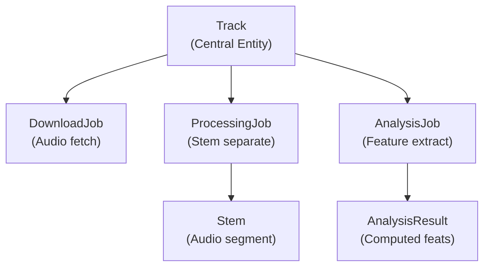
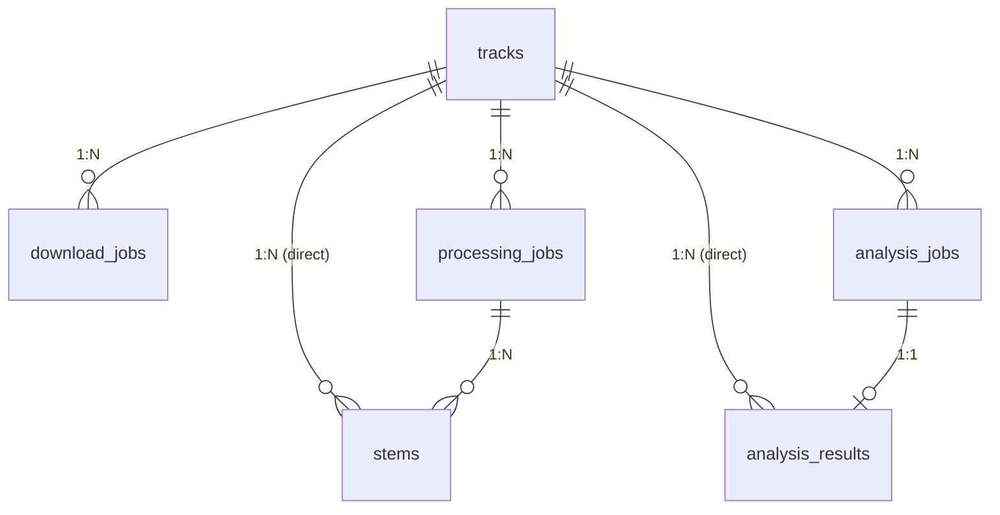
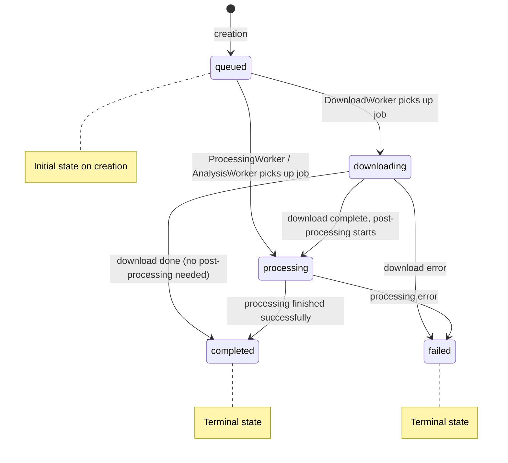

# Domain Model

## Entity Overview

Sound Forge Alchemy's domain model centers on the `Track` entity, which represents a single piece of audio. A track originates from a Spotify URL and progresses through three job pipelines -- download, stem separation, and analysis -- each producing output artifacts stored as child records.



## Entity Definitions

### Track

The root entity. Represents a single audio track, typically sourced from Spotify. All other entities belong to a track.

| Field | Type | Constraints | Description |
|-------|------|-------------|-------------|
| `id` | `binary_id` | PK, autogenerate | UUID v4 primary key |
| `spotify_id` | `string` | unique | Spotify track identifier (e.g., `"4uLU6hMCjMI75M1A2tKUQC"`) |
| `spotify_url` | `string` | -- | Full Spotify URL for the track |
| `title` | `string` | **required** | Track title |
| `artist` | `string` | -- | Primary artist name |
| `album` | `string` | -- | Album name |
| `album_art_url` | `string` | -- | URL to album artwork image |
| `duration` | `integer` | -- | Track duration in seconds |
| `inserted_at` | `utc_datetime` | auto | Creation timestamp |
| `updated_at` | `utc_datetime` | auto | Last modification timestamp |

**Relationships:**
- `has_many :download_jobs` -- One or more download attempts
- `has_many :processing_jobs` -- One or more stem separation runs
- `has_many :analysis_jobs` -- One or more analysis runs
- `has_many :stems` -- All separated stems across all processing jobs
- `has_many :analysis_results` -- All analysis results across all analysis jobs

**Changeset validations:**
- `title` is required
- `spotify_id` has a unique constraint (prevents duplicate imports)

### DownloadJob

Tracks the lifecycle of an audio file download. Created when a user requests a download and updated as the `DownloadWorker` progresses.

| Field | Type | Constraints | Description |
|-------|------|-------------|-------------|
| `id` | `binary_id` | PK, autogenerate | UUID v4 primary key |
| `track_id` | `binary_id` | **required**, FK | Reference to parent Track |
| `status` | `Ecto.Enum` | **required**, default: `:queued` | Current job status |
| `progress` | `integer` | default: `0`, range: 0..100 | Completion percentage |
| `output_path` | `string` | -- | Filesystem path to downloaded file |
| `file_size` | `integer` | -- | Downloaded file size in bytes |
| `error` | `string` | -- | Error message if status is `:failed` |
| `inserted_at` | `utc_datetime` | auto | Creation timestamp |
| `updated_at` | `utc_datetime` | auto | Last modification timestamp |

**Status values:** `:queued`, `:downloading`, `:processing`, `:completed`, `:failed`

**Changeset validations:**
- `track_id` is required with foreign key constraint
- `progress` must be between 0 and 100 (inclusive)
- `status` must be one of the defined status values

### ProcessingJob

Tracks stem separation operations. Each run uses a specific Demucs model and produces a set of stem files.

| Field | Type | Constraints | Description |
|-------|------|-------------|-------------|
| `id` | `binary_id` | PK, autogenerate | UUID v4 primary key |
| `track_id` | `binary_id` | **required**, FK | Reference to parent Track |
| `model` | `string` | default: `"htdemucs"` | Demucs model name |
| `status` | `Ecto.Enum` | **required**, default: `:queued` | Current job status |
| `progress` | `integer` | default: `0`, range: 0..100 | Completion percentage |
| `output_path` | `string` | -- | Directory containing output stems |
| `options` | `map` | -- | Additional processing options (JSON) |
| `error` | `string` | -- | Error message if status is `:failed` |
| `inserted_at` | `utc_datetime` | auto | Creation timestamp |
| `updated_at` | `utc_datetime` | auto | Last modification timestamp |

**Status values:** `:queued`, `:downloading`, `:processing`, `:completed`, `:failed`

**Relationships:**
- `belongs_to :track`
- `has_many :stems` -- The stem files produced by this job

**Changeset validations:**
- `track_id` is required with foreign key constraint
- `progress` must be between 0 and 100 (inclusive)
- `status` must be one of the defined status values

### AnalysisJob

Tracks audio feature analysis operations. When complete, an `AnalysisResult` record stores the extracted features.

| Field | Type | Constraints | Description |
|-------|------|-------------|-------------|
| `id` | `binary_id` | PK, autogenerate | UUID v4 primary key |
| `track_id` | `binary_id` | **required**, FK | Reference to parent Track |
| `status` | `Ecto.Enum` | **required**, default: `:queued` | Current job status |
| `progress` | `integer` | default: `0`, range: 0..100 | Completion percentage |
| `results` | `map` | -- | Inline results (JSON), includes analysis type and file path |
| `error` | `string` | -- | Error message if status is `:failed` |
| `inserted_at` | `utc_datetime` | auto | Creation timestamp |
| `updated_at` | `utc_datetime` | auto | Last modification timestamp |

**Status values:** `:queued`, `:downloading`, `:processing`, `:completed`, `:failed`

**Relationships:**
- `belongs_to :track`
- `has_one :analysis_result` -- The structured result record produced by this job

### Stem

A single audio stem file produced by a processing job. Each stem represents one isolated component of the original audio (e.g., just the vocals, just the drums).

| Field | Type | Constraints | Description |
|-------|------|-------------|-------------|
| `id` | `binary_id` | PK, autogenerate | UUID v4 primary key |
| `processing_job_id` | `binary_id` | **required**, FK | Reference to parent ProcessingJob |
| `track_id` | `binary_id` | **required**, FK | Reference to parent Track |
| `stem_type` | `Ecto.Enum` | **required** | Type of stem |
| `file_path` | `string` | -- | Filesystem path to the stem audio file |
| `file_size` | `integer` | -- | Stem file size in bytes |
| `inserted_at` | `utc_datetime` | auto | Creation timestamp |
| `updated_at` | `utc_datetime` | auto | Last modification timestamp |

**Stem type values (current):** `:vocals`, `:drums`, `:bass`, `:other`

**Changeset validations:**
- `processing_job_id`, `track_id`, and `stem_type` are all required
- `stem_type` must be one of the defined values
- Foreign key constraints on both `processing_job_id` and `track_id`

### AnalysisResult

Structured audio analysis output. Stores individual feature values as typed columns and a `features` map for extensible data.

| Field | Type | Constraints | Description |
|-------|------|-------------|-------------|
| `id` | `binary_id` | PK, autogenerate | UUID v4 primary key |
| `track_id` | `binary_id` | **required**, FK | Reference to parent Track |
| `analysis_job_id` | `binary_id` | **required**, FK | Reference to parent AnalysisJob |
| `tempo` | `float` | -- | Beats per minute (BPM) |
| `key` | `string` | -- | Musical key (e.g., `"C major"`, `"F# minor"`) |
| `energy` | `float` | -- | RMS energy level (0.0 to 1.0) |
| `spectral_centroid` | `float` | -- | Spectral centroid in Hz (brightness indicator) |
| `spectral_rolloff` | `float` | -- | Spectral rolloff frequency in Hz |
| `zero_crossing_rate` | `float` | -- | Zero crossing rate (percussiveness indicator) |
| `features` | `map` | -- | Additional features as JSON (MFCC, chroma, etc.) |
| `inserted_at` | `utc_datetime` | auto | Creation timestamp |
| `updated_at` | `utc_datetime` | auto | Last modification timestamp |

**Changeset validations:**
- `track_id` and `analysis_job_id` are required
- Foreign key constraints on both

## Relationships Diagram



A `Track` can have multiple jobs of each type because:
- A download may fail and be retried, creating a new `DownloadJob`
- A user may re-process with a different Demucs model, creating a new `ProcessingJob`
- Analysis may be run with different feature sets, creating a new `AnalysisJob`

`Stem` has dual foreign keys to both `ProcessingJob` (its creator) and `Track` (for efficient queries). Similarly, `AnalysisResult` belongs to both `AnalysisJob` and `Track`.

## Job Status State Machine

All three job types share the same set of status values and follow the same state machine:



### Status Definitions

| Status | Meaning | Applies To |
|--------|---------|------------|
| `:queued` | Job created, waiting for Oban to pick it up | All job types |
| `:downloading` | Actively downloading audio file | DownloadJob |
| `:processing` | Actively running Demucs or librosa | ProcessingJob, AnalysisJob |
| `:completed` | Job finished successfully, output available | All job types |
| `:failed` | Job encountered an error, `error` field populated | All job types |

### Valid Transitions

```elixir
# Forward-only transitions (no going backward)
:queued       -> :downloading   # DownloadWorker picks up job
:queued       -> :processing    # ProcessingWorker/AnalysisWorker picks up job
:downloading  -> :processing    # Download complete, post-processing starts
:downloading  -> :completed     # Download done (no post-processing needed)
:downloading  -> :failed        # Download error (network, spotdl failure)
:processing   -> :completed     # Processing finished successfully
:processing   -> :failed        # Processing error (Demucs/librosa failure)
```

Note: Status transition validation is currently enforced at the application level by the worker implementations. A formal state machine guard function is planned but not yet implemented (see `03_FUNCTIONAL_CORE.md` for the design).

### Status in the DownloadWorker

The actual transition flow as implemented in `SoundForge.Jobs.DownloadWorker.perform/1`:

```elixir
# 1. Transition: :queued -> :downloading
job = Music.get_download_job!(job_id)
Music.update_download_job(job, %{status: :downloading, progress: 0})
broadcast_progress(job_id, :downloading, 0)

# 2. Execute download (spotdl)
case execute_download(spotify_url, quality, track_id) do
  {:ok, %{path: output_path, size: file_size}} ->
    # 3a. Transition: :downloading -> :completed
    Music.update_download_job(job, %{
      status: :completed,
      progress: 100,
      output_path: output_path,
      file_size: file_size
    })
    broadcast_progress(job_id, :completed, 100)

  {:error, reason} ->
    # 3b. Transition: :downloading -> :failed
    Music.update_download_job(job, %{status: :failed, error: reason})
    broadcast_progress(job_id, :failed, 0)
end
```

## Stem Types

### 4-Stem Models (htdemucs, htdemucs_ft, mdx_extra)

The default Demucs model (`htdemucs`) and its variants separate audio into four stems:

| Stem Type | Description | Typical Content |
|-----------|-------------|-----------------|
| `:vocals` | Human voice | Lead vocals, backing vocals, spoken word |
| `:drums` | Percussion | Kick, snare, hi-hat, cymbals, toms |
| `:bass` | Bass frequencies | Bass guitar, synth bass, sub-bass |
| `:other` | Everything else | Guitar, keyboards, synths, strings, effects |

These four types are the values currently defined in the `Stem` schema:

```elixir
# From lib/sound_forge/music/stem.ex
@stem_type_values [:vocals, :drums, :bass, :other]
```

### 6-Stem Model (htdemucs_6s)

The `htdemucs_6s` model provides finer separation with two additional stems:

| Stem Type | Description |
|-----------|-------------|
| `:vocals` | Human voice |
| `:drums` | Percussion |
| `:bass` | Bass frequencies |
| `:guitar` | Guitar (acoustic and electric) |
| `:piano` | Piano and keyboard instruments |
| `:other` | Remaining instruments and effects |

The `htdemucs_6s` model is listed in `SoundForge.Processing.Demucs.list_models/0` but the Stem schema's enum currently only includes the 4-stem types. Supporting the 6-stem model will require a schema migration to add `:guitar` and `:piano` to the `@stem_type_values` list.

### Model Configuration

Available models are defined in `SoundForge.Processing.Demucs`:

```elixir
# From lib/sound_forge/processing/demucs.ex
@models [
  %{
    name: "htdemucs",
    description: "Hybrid Transformer Demucs - default 4-stem model (vocals, drums, bass, other)",
    stems: 4
  },
  %{
    name: "htdemucs_ft",
    description: "Fine-tuned Hybrid Transformer Demucs - higher quality, slower",
    stems: 4
  },
  %{
    name: "htdemucs_6s",
    description: "6-stem model (vocals, drums, bass, guitar, piano, other)",
    stems: 6
  },
  %{
    name: "mdx_extra",
    description: "MDX-Net Extra - alternative architecture, good for vocals",
    stems: 4
  }
]
```

The `DemucsPort` GenServer validates models against its own list:

```elixir
# From lib/sound_forge/audio/demucs_port.ex
@valid_models ~w(htdemucs htdemucs_ft mdx_extra)
```

Note the discrepancy: `htdemucs_6s` is listed in the Demucs configuration module but is not in the DemucsPort's valid model list. This is a known gap to be resolved.

## Analysis Features

The `AnalyzerPort` supports seven feature categories. Features are requested by name when calling `analyze/2`:

```elixir
# From lib/sound_forge/audio/analyzer_port.ex
@valid_features ~w(tempo key energy spectral mfcc chroma all)
```

### Feature Definitions

| Feature | Description | Output Fields | librosa Function |
|---------|-------------|---------------|-----------------|
| `tempo` | Beats per minute detection with beat tracking | `tempo` (float, BPM) | `librosa.beat.beat_track` |
| `key` | Musical key detection (major/minor) | `key` (string, e.g., `"C major"`) | Chroma analysis + Krumhansl-Schmuckler algorithm |
| `energy` | RMS energy and zero-crossing rate | `energy` (float), `zero_crossing_rate` (float) | `librosa.feature.rms`, `librosa.feature.zero_crossing_rate` |
| `spectral` | Spectral shape descriptors | `spectral_centroid` (float, Hz), `spectral_rolloff` (float, Hz), bandwidth, contrast | `librosa.feature.spectral_centroid`, `spectral_rolloff`, etc. |
| `mfcc` | Mel-frequency cepstral coefficients | Array of 13 coefficients per frame | `librosa.feature.mfcc` |
| `chroma` | Chromagram (pitch class) features | 12-dimensional chroma vector per frame | `librosa.feature.chroma_stft` |
| `all` | Extract all available features | All of the above | All of the above |

### AnalysisResult Column Mapping

The typed columns on `AnalysisResult` store the most commonly queried features for efficient access:

| Column | Feature Source | Type | Unit |
|--------|--------------|------|------|
| `tempo` | `tempo` | float | BPM |
| `key` | `key` | string | Musical key name |
| `energy` | `energy` | float | Normalized RMS (0.0 - 1.0) |
| `spectral_centroid` | `spectral` | float | Hz |
| `spectral_rolloff` | `spectral` | float | Hz |
| `zero_crossing_rate` | `energy` | float | Rate (0.0 - 1.0) |
| `features` | all | map | JSON blob for MFCC, chroma, and any extended data |

The `features` map column serves as an extensible store for high-dimensional data (MFCC coefficients, chromagram arrays) and any future features added to the analyzer without requiring schema migrations.
