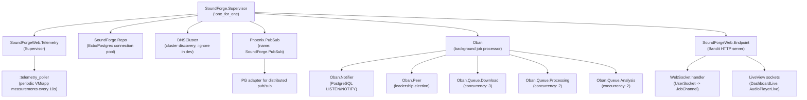
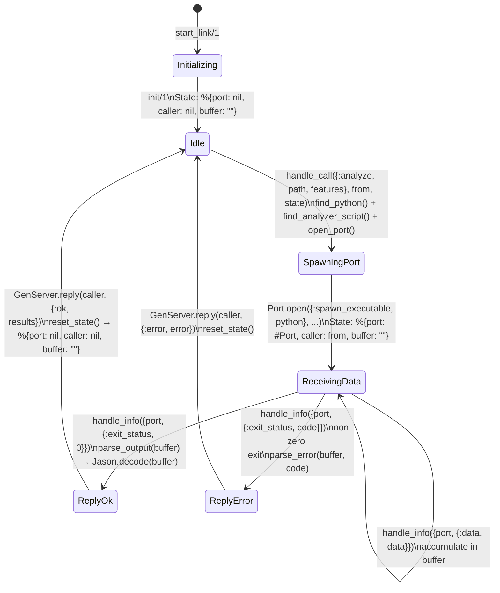
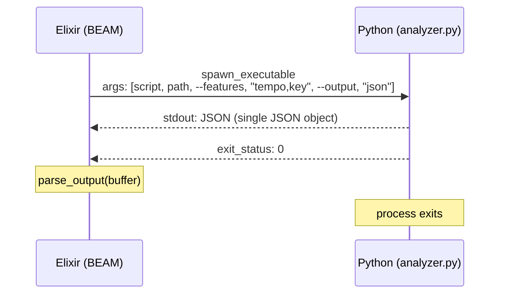
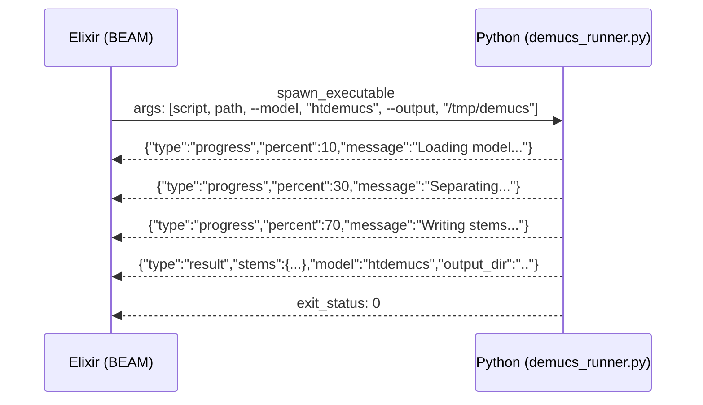
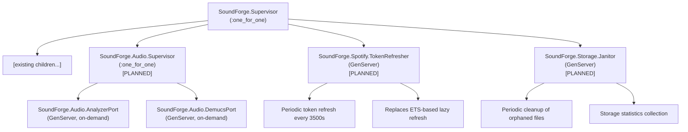

# 05 -- Process Lifecycle

## Overview

Sound Forge Alchemy is a single OTP application (`SoundForge.Application`) that starts a flat supervision tree using the `:one_for_one` strategy. Each child process is independent -- if one crashes, only that process restarts, leaving the rest of the system operational. The application manages database connections, PubSub messaging, background job processing, telemetry collection, and HTTP serving.

---

## Supervision Tree



### Application Start

```elixir
defmodule SoundForge.Application do
  use Application

  @impl true
  def start(_type, _args) do
    # Initialize Spotify HTTP client ETS table for token caching
    SoundForge.Spotify.HTTPClient.init()

    children = [
      SoundForgeWeb.Telemetry,
      SoundForge.Repo,
      {DNSCluster, query: Application.get_env(:sound_forge, :dns_cluster_query) || :ignore},
      {Phoenix.PubSub, name: SoundForge.PubSub},
      {Oban, Application.fetch_env!(:sound_forge, Oban)},
      SoundForgeWeb.Endpoint
    ]

    opts = [strategy: :one_for_one, name: SoundForge.Supervisor]
    Supervisor.start_link(children, opts)
  end
end
```

**Startup order matters**: The children list is started sequentially from top to bottom. This ensures:

1. **Telemetry** is available before any other process emits events
2. **Repo** establishes database connections before Oban needs them
3. **PubSub** is running before Oban workers try to broadcast
4. **Oban** is ready to process jobs before the Endpoint accepts requests
5. **Endpoint** starts last, accepting traffic only when all backing services are live

### ETS Table Initialization

Before the supervision tree starts, the application initializes the Spotify token cache ETS table:

```elixir
SoundForge.Spotify.HTTPClient.init()

def init do
  :ets.new(:spotify_tokens, [:named_table, :public, :set])
rescue
  ArgumentError -> :already_exists  # idempotent
end
```

This runs outside the supervision tree because ETS tables are owned by the creating process (the Application process itself), which lives for the duration of the application. If the table were created inside a GenServer, its crash would destroy the table.

---

## Child Process Details

### SoundForgeWeb.Telemetry

A Supervisor that starts a `:telemetry_poller` process for periodic measurements. Collects VM memory, run queue lengths, and application-specific metrics every 10 seconds.

```elixir
defmodule SoundForgeWeb.Telemetry do
  use Supervisor

  def init(_arg) do
    children = [
      {:telemetry_poller, measurements: periodic_measurements(), period: 10_000}
    ]
    Supervisor.init(children, strategy: :one_for_one)
  end
end
```

**Metrics defined** (exposed at `/dev/dashboard` via LiveDashboard):

| Category | Metric | Unit |
|----------|--------|------|
| Phoenix | `phoenix.endpoint.stop.duration` | ms |
| Phoenix | `phoenix.router_dispatch.stop.duration` | ms (per route) |
| Phoenix | `phoenix.socket_connected.duration` | ms |
| Phoenix | `phoenix.channel_joined.duration` | ms |
| Phoenix | `phoenix.channel_handled_in.duration` | ms (per event) |
| Ecto | `sound_forge.repo.query.total_time` | ms |
| Ecto | `sound_forge.repo.query.query_time` | ms |
| Ecto | `sound_forge.repo.query.queue_time` | ms |
| Ecto | `sound_forge.repo.query.decode_time` | ms |
| Ecto | `sound_forge.repo.query.idle_time` | ms |
| VM | `vm.memory.total` | KB |
| VM | `vm.total_run_queue_lengths.total` | count |
| VM | `vm.total_run_queue_lengths.cpu` | count |
| VM | `vm.total_run_queue_lengths.io` | count |

### SoundForge.Repo

Ecto repository backed by Postgrex. Manages a connection pool to PostgreSQL. Configuration varies by environment:

```elixir
# config/dev.exs
config :sound_forge, SoundForge.Repo,
  username: "postgres",
  password: "postgres",
  hostname: "localhost",
  database: "sound_forge_dev",
  pool_size: 10
```

### Oban

Configured in `config/config.exs` with three queues:

```elixir
config :sound_forge, Oban,
  repo: SoundForge.Repo,
  queues: [download: 3, processing: 2, analysis: 2]
```

Oban uses PostgreSQL (via the Repo) for job persistence and LISTEN/NOTIFY for real-time job dispatch. No Redis required. See `06_WORKERS.md` for queue details.

### SoundForgeWeb.Endpoint

The HTTP endpoint uses the Bandit adapter (not Cowboy). It serves both traditional HTTP requests and WebSocket connections:

```elixir
config :sound_forge, SoundForgeWeb.Endpoint,
  adapter: Bandit.PhoenixAdapter,
  pubsub_server: SoundForge.PubSub,
  live_view: [signing_salt: "RnUPXfw7"]
```

---

## GenServer Lifecycle: Erlang Ports

The `AnalyzerPort` and `DemucsPort` GenServers manage Python process communication via Erlang Ports. These are infrastructure services -- they wrap OS-level process management, not domain logic.

### Important: NOT in the Supervision Tree

Currently, `AnalyzerPort` and `DemucsPort` are **not** started as children in `SoundForge.Application`. They are designed to be started on demand by Oban workers or explicitly via `start_link/1`. This is intentional:

- Audio processing is expensive and intermittent
- Port processes should not outlive their work
- Each worker invocation gets a fresh port process

The planned approach is for Oban workers to start and stop ports within their `perform/1` callback:

```elixir
# Planned ProcessingWorker pattern
def perform(%Oban.Job{args: args}) do
  {:ok, pid} = SoundForge.Audio.DemucsPort.start_link([])
  try do
    SoundForge.Audio.DemucsPort.separate(audio_path, opts)
  after
    GenServer.stop(pid)
  end
end
```

### AnalyzerPort Lifecycle



### Port Communication Protocol

**AnalyzerPort** uses a single-shot protocol:



**DemucsPort** uses a JSON-lines streaming protocol:



Each newline-delimited JSON line is parsed independently:

```elixir
defp extract_lines(buffer) do
  lines = String.split(buffer, "\n")
  case List.pop_at(lines, -1) do
    {incomplete, complete_lines} ->
      {complete_lines, incomplete || ""}
    nil ->
      {[], buffer}
  end
end

defp process_json_line(line, state) do
  case Jason.decode(String.trim(line)) do
    {:ok, %{"type" => "progress", "percent" => percent, "message" => message}} ->
      handle_progress(percent, message, state)
    {:ok, %{"type" => "error"}} ->
      :ok  # handled by exit_status
    {:ok, %{"type" => "result"}} ->
      :ok  # handled by exit_status
    _ ->
      Logger.debug("Unrecognized output: #{line}")
  end
end
```

### Timeout Handling

Both ports use `GenServer.call/3` with explicit timeouts:

| Port | Timeout | Rationale |
|------|---------|-----------|
| AnalyzerPort | 120,000ms (2 min) | Feature extraction is CPU-bound, ~30-90s for a typical track |
| DemucsPort | 300,000ms (5 min) | Neural network inference, model loading, stem writing |

If the Python process hangs beyond the timeout, the calling process receives a `{:EXIT, ...}` message and the port is cleaned up by the BEAM. The GenServer state is reset, ready for the next request.

---

## Process Monitoring and Crash Recovery

### Supervisor Strategy

The top-level supervisor uses `:one_for_one`, meaning each child is independent:

```elixir
opts = [strategy: :one_for_one, name: SoundForge.Supervisor]
```

| Crash Scenario | Effect | Recovery |
|----------------|--------|----------|
| Repo crashes | DB queries fail | Repo restarts, connection pool rebuilt |
| PubSub crashes | Broadcasts silently dropped | PubSub restarts, subscriptions lost (LiveViews reconnect) |
| Oban crashes | Job processing stops | Oban restarts, resumes from PostgreSQL state |
| Endpoint crashes | HTTP/WebSocket connections dropped | Endpoint restarts, clients reconnect |
| Telemetry crashes | Metrics collection stops | Telemetry restarts, poller resumes |

### Port Crash Recovery

When a Python process crashes (segfault, OOM kill, unhandled exception), the BEAM receives an `{:exit_status, code}` message. The GenServer handles this by replying with an error and resetting state:

```elixir
def handle_info({port, {:exit_status, code}}, %{port: port, caller: caller, buffer: buffer} = state) do
  error = parse_error(buffer, code)
  GenServer.reply(caller, {:error, error})
  {:noreply, reset_state(state)}
end
```

The GenServer itself does not crash -- it remains available for the next request. This is intentional: crashing the GenServer would lose the caller reference, preventing an error reply.

### Oban Job Resilience

Oban stores all job state in PostgreSQL. If the BEAM node crashes mid-job:

1. Oban detects the job as "stuck" on next startup (via the `Oban.Plugins.Lifeline` plugin or peer coordination)
2. The job is re-enqueued for retry (up to `max_attempts`)
3. The worker's `perform/1` is invoked again with the same args

This is why workers are idempotent: re-downloading a file to the same path overwrites the previous partial download.

### LiveView Reconnection

When a LiveView process crashes or the WebSocket disconnects, Phoenix LiveView automatically reconnects the client:

1. Client JavaScript detects disconnection
2. Exponential backoff reconnection attempts
3. On reconnect, `mount/3` is called again
4. PubSub subscriptions are re-established (via `if connected?(socket)` guard)
5. UI state is rebuilt from database

---

## Telemetry Integration

### Phoenix Telemetry

Phoenix automatically emits telemetry events for HTTP requests, WebSocket connections, and channel operations. These are consumed by the metrics definitions in `SoundForgeWeb.Telemetry`:

```elixir
def metrics do
  [
    summary("phoenix.endpoint.stop.duration", unit: {:native, :millisecond}),
    summary("phoenix.router_dispatch.stop.duration", tags: [:route], unit: {:native, :millisecond}),
    summary("phoenix.socket_connected.duration", unit: {:native, :millisecond}),
    summary("phoenix.channel_joined.duration", unit: {:native, :millisecond}),
    summary("phoenix.channel_handled_in.duration", tags: [:event], unit: {:native, :millisecond}),
    sum("phoenix.socket_drain.count")
  ]
end
```

### Ecto Telemetry

Every database query emits timing telemetry. The most useful metrics for performance debugging:

```elixir
summary("sound_forge.repo.query.total_time", unit: {:native, :millisecond}),
summary("sound_forge.repo.query.query_time", unit: {:native, :millisecond}),
summary("sound_forge.repo.query.queue_time", unit: {:native, :millisecond}),
summary("sound_forge.repo.query.idle_time", unit: {:native, :millisecond})
```

- **queue_time**: Time waiting for a connection from the pool -- high values indicate pool exhaustion
- **query_time**: Time the database spent executing the query -- high values indicate slow queries
- **idle_time**: Time the connection was idle before checkout -- baseline indicator

### Oban Telemetry

Oban 2.18 emits telemetry events for job execution. These are not yet wired into the metrics module but are available:

```
[:oban, :job, :start]     # Job execution begins
[:oban, :job, :stop]      # Job execution completes
[:oban, :job, :exception] # Job raises an exception
```

**Planned telemetry integration**:

```elixir
# Planned addition to SoundForgeWeb.Telemetry.metrics/0
summary("oban.job.stop.duration",
  unit: {:native, :millisecond},
  tags: [:queue, :worker]
),
counter("oban.job.exception.count",
  tags: [:queue, :worker]
)
```

### VM Telemetry

The periodic poller collects BEAM VM metrics every 10 seconds:

```elixir
summary("vm.memory.total", unit: {:byte, :kilobyte}),
summary("vm.total_run_queue_lengths.total"),
summary("vm.total_run_queue_lengths.cpu"),
summary("vm.total_run_queue_lengths.io")
```

- **Run queue lengths**: Number of processes waiting for scheduler time. Values consistently above 0 indicate CPU saturation.
- **Memory total**: Total BEAM memory usage. Watch for monotonic growth indicating leaks.

### LiveDashboard

In development, all metrics are visualizable at `/dev/dashboard`:

```elixir
# From router.ex
if Application.compile_env(:sound_forge, :dev_routes) do
  scope "/dev" do
    pipe_through :browser
    live_dashboard "/dashboard", metrics: SoundForgeWeb.Telemetry
  end
end
```

---

## Planned Supervision Tree Additions

As the application matures, the supervision tree will expand:



The Audio.Supervisor would use `DynamicSupervisor` to start port processes on demand and supervise them for the duration of their work, rather than requiring callers to manage lifecycle manually.
