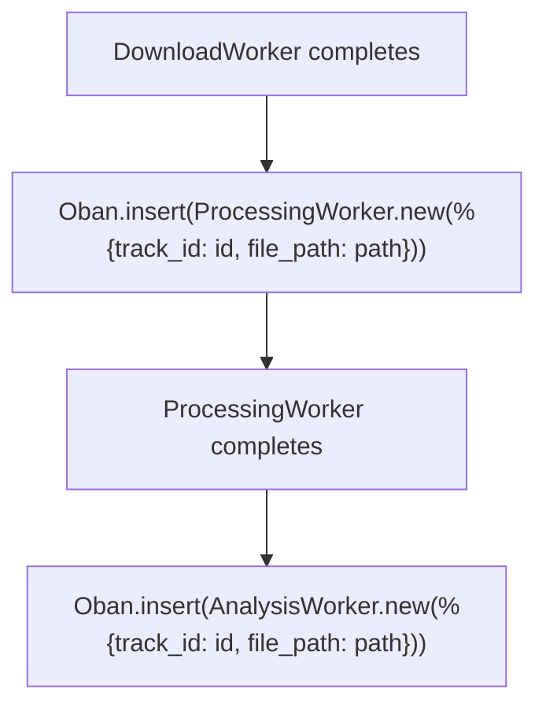

# 06 -- Oban Worker Architecture

## Overview

Sound Forge Alchemy uses Oban 2.18 for background job processing, replacing the Redis-backed custom job queue from the TypeScript predecessor. Oban stores all job state in PostgreSQL (via the `oban_jobs` table), uses LISTEN/NOTIFY for real-time dispatch, and provides built-in retry logic, unique job constraints, and queue-level concurrency control.

All workers broadcast progress updates via `Phoenix.PubSub` to the `"jobs:{job_id}"` topic, enabling real-time UI updates through both WebSocket channels and LiveView.

---

## Queue Configuration

```elixir
# config/config.exs
config :sound_forge, Oban,
  repo: SoundForge.Repo,
  queues: [download: 3, processing: 2, analysis: 2]
```

| Queue | Concurrency | Purpose | Worker |
|-------|-------------|---------|--------|
| `:download` | 3 | Spotify/YouTube downloads via spotdl | `DownloadWorker` |
| `:processing` | 2 | Stem separation via Demucs | `ProcessingWorker` (planned) |
| `:analysis` | 2 | Audio feature extraction via librosa | `AnalysisWorker` (planned) |

**Concurrency rationale**:
- **Download (3)**: Network-bound. Three concurrent downloads saturate typical bandwidth without overwhelming spotdl's rate limiting.
- **Processing (2)**: GPU/CPU-bound. Demucs uses significant memory (~2-4GB per instance). Two concurrent jobs balance throughput against memory pressure.
- **Analysis (2)**: CPU-bound. Librosa feature extraction is computationally intensive but lighter than Demucs. Two workers keep the CPU busy without starving other queues.

---

## Database Migration

Oban requires its own table, created via the standard Oban migration:

```elixir
# priv/repo/migrations/20260212081450_add_oban_jobs_table.exs
defmodule SoundForge.Repo.Migrations.AddObanJobsTable do
  use Ecto.Migration

  def up do
    Oban.Migration.up(version: 12)
  end

  def down do
    Oban.Migration.down(version: 1)
  end
end
```

---

## DownloadWorker

The `DownloadWorker` is the only fully implemented Oban worker. It handles downloading audio from Spotify URLs using the `spotdl` CLI tool, tracking progress in the database and broadcasting updates via PubSub.

### Implementation

```elixir
defmodule SoundForge.Jobs.DownloadWorker do
  use Oban.Worker,
    queue: :download,
    max_attempts: 3,
    priority: 1

  alias SoundForge.Music

  @impl Oban.Worker
  def perform(%Oban.Job{
        args: %{
          "track_id" => track_id,
          "spotify_url" => spotify_url,
          "quality" => quality,
          "job_id" => job_id
        }
      }) do
    # Update job status to downloading
    job = Music.get_download_job!(job_id)
    Music.update_download_job(job, %{status: :downloading, progress: 0})
    broadcast_progress(job_id, :downloading, 0)

    # Execute download (spotdl CLI)
    case execute_download(spotify_url, quality, track_id) do
      {:ok, %{path: output_path, size: file_size}} ->
        Music.update_download_job(job, %{
          status: :completed,
          progress: 100,
          output_path: output_path,
          file_size: file_size
        })
        broadcast_progress(job_id, :completed, 100)
        :ok

      {:error, reason} ->
        Music.update_download_job(job, %{status: :failed, error: reason})
        broadcast_progress(job_id, :failed, 0)
        {:error, reason}
    end
  end
end
```

### Download Execution

The worker shells out to `spotdl` with the following arguments:

```elixir
defp execute_download(spotify_url, quality, track_id) do
  output_dir = Application.get_env(:sound_forge, :downloads_dir, "priv/uploads/downloads")
  File.mkdir_p!(output_dir)

  output_file = Path.join(output_dir, "#{track_id}.mp3")

  args = [
    spotify_url,
    "--output", output_file,
    "--format", "mp3",
    "--bitrate", quality    # "320k"
  ]

  case System.cmd("spotdl", args, stderr_to_stdout: true) do
    {_output, 0} ->
      file_size =
        case File.stat(output_file) do
          {:ok, %{size: size}} -> size
          {:error, _} -> 0
        end
      {:ok, %{path: output_file, size: file_size}}

    {error_output, _code} ->
      {:error, "Download failed: #{error_output}"}
  end
end
```

**File naming**: Uses `track_id` (UUID) as the filename to avoid conflicts and ensure idempotent re-downloads. The file overwrites on retry.

### Progress Broadcasting

```elixir
defp broadcast_progress(job_id, status, progress) do
  Phoenix.PubSub.broadcast(
    SoundForge.PubSub,
    "jobs:#{job_id}",
    {:job_progress, %{job_id: job_id, status: status, progress: progress}}
  )
end
```

The broadcast fires at two points:
1. When the download starts (`:downloading`, 0%)
2. When the download completes (`:completed`, 100%) or fails (`:failed`, 0%)

### Job Enqueuing

Jobs are enqueued by the `SoundForge.Jobs.Download` context module:

```elixir
defp enqueue_worker(job, track, url) do
  %{
    track_id: track.id,
    spotify_url: url,
    quality: "320k",
    job_id: job.id
  }
  |> SoundForge.Jobs.DownloadWorker.new()
  |> Oban.insert()
end
```

The `new/1` function (provided by `use Oban.Worker`) creates an `Oban.Job` changeset. `Oban.insert/1` persists it to the database and triggers dispatch via NOTIFY.

---

## ProcessingWorker (Planned)

The `ProcessingWorker` will integrate with the `DemucsPort` GenServer to perform stem separation.

### Planned Implementation

```elixir
defmodule SoundForge.Jobs.ProcessingWorker do
  use Oban.Worker,
    queue: :processing,
    max_attempts: 3,
    priority: 2

  alias SoundForge.Music
  alias SoundForge.Audio.DemucsPort
  alias SoundForge.Storage

  @impl Oban.Worker
  def perform(%Oban.Job{
        args: %{
          "track_id" => track_id,
          "job_id" => job_id,
          "model" => model,
          "file_path" => file_path
        }
      }) do
    job = Music.get_processing_job!(job_id)
    Music.update_processing_job(job, %{status: :processing, progress: 0})
    broadcast_progress(job_id, :processing, 0)

    # Start a dedicated DemucsPort for this job
    {:ok, port_pid} = DemucsPort.start_link(name: nil)

    try do
      output_dir = Path.join(Storage.stems_path(), track_id)

      case DemucsPort.separate(file_path,
             model: model,
             output_dir: output_dir,
             progress_callback: &progress_callback(job_id, &1, &2)
           ) do
        {:ok, %{stems: stems}} ->
          store_stems(track_id, job_id, stems)
          Music.update_processing_job(job, %{status: :completed, progress: 100})
          broadcast_progress(job_id, :completed, 100)
          :ok

        {:error, reason} ->
          Music.update_processing_job(job, %{status: :failed, error: inspect(reason)})
          broadcast_progress(job_id, :failed, 0)
          {:error, reason}
      end
    after
      GenServer.stop(port_pid)
    end
  end

  defp progress_callback(job_id, percent, message) do
    broadcast_progress(job_id, :processing, percent)
  end

  defp store_stems(track_id, job_id, stems) do
    Enum.each(stems, fn {stem_type, path} ->
      file_size =
        case File.stat(path) do
          {:ok, %{size: size}} -> size
          _ -> 0
        end

      Music.create_stem(%{
        track_id: track_id,
        processing_job_id: job_id,
        stem_type: String.to_existing_atom(stem_type),
        file_path: path,
        file_size: file_size
      })
    end)
  end

  defp broadcast_progress(job_id, status, progress) do
    Phoenix.PubSub.broadcast(
      SoundForge.PubSub,
      "jobs:#{job_id}",
      {:job_progress, %{job_id: job_id, status: status, progress: progress}}
    )
  end
end
```

### Key Design Decisions

1. **Dedicated port per job**: Each worker invocation starts its own `DemucsPort` GenServer to avoid contention between concurrent processing jobs.
2. **Progress callback**: The DemucsPort's progress callback is wired to PubSub broadcasting, giving the client real-time percentage updates during separation.
3. **Stem storage**: Each stem file is registered in the database with its file path and size, linked to both the track and processing job.

---

## AnalysisWorker (Planned)

The `AnalysisWorker` will integrate with the `AnalyzerPort` GenServer for audio feature extraction.

### Planned Implementation

```elixir
defmodule SoundForge.Jobs.AnalysisWorker do
  use Oban.Worker,
    queue: :analysis,
    max_attempts: 3,
    priority: 2

  alias SoundForge.Music
  alias SoundForge.Audio.AnalyzerPort

  @impl Oban.Worker
  def perform(%Oban.Job{
        args: %{
          "track_id" => track_id,
          "job_id" => job_id,
          "file_path" => file_path,
          "features" => features
        }
      }) do
    job = Music.get_analysis_job!(job_id)
    Music.update_analysis_job(job, %{status: :processing, progress: 0})
    broadcast_progress(job_id, :processing, 0)

    {:ok, port_pid} = AnalyzerPort.start_link(name: nil)

    try do
      case AnalyzerPort.analyze(file_path, features) do
        {:ok, results} ->
          store_results(track_id, job_id, results)
          Music.update_analysis_job(job, %{
            status: :completed,
            progress: 100,
            results: results
          })
          broadcast_progress(job_id, :completed, 100)
          :ok

        {:error, reason} ->
          Music.update_analysis_job(job, %{status: :failed, error: inspect(reason)})
          broadcast_progress(job_id, :failed, 0)
          {:error, reason}
      end
    after
      GenServer.stop(port_pid)
    end
  end

  defp store_results(track_id, job_id, results) do
    Music.create_analysis_result(%{
      track_id: track_id,
      analysis_job_id: job_id,
      tempo: get_in(results, ["tempo", "bpm"]),
      key: get_in(results, ["key", "key"]),
      energy: get_in(results, ["energy", "rms_mean"]),
      spectral_centroid: get_in(results, ["spectral", "centroid_mean"]),
      spectral_rolloff: get_in(results, ["spectral", "rolloff_mean"]),
      zero_crossing_rate: get_in(results, ["energy", "zcr_mean"]),
      features: results
    })
  end

  defp broadcast_progress(job_id, status, progress) do
    Phoenix.PubSub.broadcast(
      SoundForge.PubSub,
      "jobs:#{job_id}",
      {:job_progress, %{job_id: job_id, status: status, progress: progress}}
    )
  end
end
```

### Feature Mapping

The Python analyzer returns a nested JSON structure. The worker flattens specific fields into the `AnalysisResult` schema columns while preserving the full results in the `:features` JSONB column:

| Python Output Path | Schema Column | Type |
|-------------------|---------------|------|
| `results.tempo.bpm` | `:tempo` | float |
| `results.key.key` | `:key` | string |
| `results.energy.rms_mean` | `:energy` | float |
| `results.spectral.centroid_mean` | `:spectral_centroid` | float |
| `results.spectral.rolloff_mean` | `:spectral_rolloff` | float |
| `results.energy.zcr_mean` | `:zero_crossing_rate` | float |
| (entire result map) | `:features` | map (JSONB) |

---

## Retry Strategies

### Default Configuration

All workers use Oban's built-in retry with exponential backoff:

```elixir
use Oban.Worker,
  queue: :download,
  max_attempts: 3,
  priority: 1
```

Oban's default backoff formula: `attempt^4 + 6 + (attempt * rand(0..15))` seconds.

| Attempt | Approximate Delay |
|---------|-------------------|
| 1 | immediate |
| 2 | ~22-37 seconds |
| 3 | ~78-123 seconds |

### Priority-Based Ordering

Lower priority numbers execute first within a queue:

| Worker | Priority | Rationale |
|--------|----------|-----------|
| DownloadWorker | 1 | Downloads are fast, unblock processing |
| ProcessingWorker | 2 | Longer-running, lower urgency |
| AnalysisWorker | 2 | Can run after processing completes |

### Planned: Custom Backoff

For download failures (network issues, rate limiting), a custom backoff strategy can be implemented:

```elixir
defmodule SoundForge.Jobs.DownloadWorker do
  use Oban.Worker,
    queue: :download,
    max_attempts: 5

  @impl Oban.Worker
  def backoff(%Oban.Job{attempt: attempt, args: %{"retry_reason" => "rate_limit"}}) do
    # Longer backoff for rate limiting: 60s, 120s, 240s, 480s
    60 * :math.pow(2, attempt - 1) |> trunc()
  end

  def backoff(%Oban.Job{attempt: attempt}) do
    # Default exponential backoff for other failures
    :math.pow(attempt, 4) |> trunc() |> max(1)
  end
end
```

### Planned: Unique Jobs

To prevent duplicate downloads for the same Spotify URL:

```elixir
use Oban.Worker,
  queue: :download,
  max_attempts: 3,
  unique: [period: 300, fields: [:args], keys: [:spotify_url]]
```

This ensures only one download job per Spotify URL exists within a 5-minute window.

---

## Job Chaining

A common workflow chains download -> processing -> analysis. The planned pattern uses Oban's `insert/1` at the end of each worker:



```elixir
# Planned: chain from DownloadWorker
def perform(%Oban.Job{args: args}) do
  case execute_download(args) do
    {:ok, %{path: output_path}} ->
      # Automatically enqueue processing
      %{
        track_id: args["track_id"],
        job_id: create_processing_job_id(args["track_id"]),
        model: "htdemucs",
        file_path: output_path
      }
      |> SoundForge.Jobs.ProcessingWorker.new()
      |> Oban.insert()

      :ok

    {:error, reason} ->
      {:error, reason}
  end
end
```

---

## Worker Testing

### Test Configuration

Oban provides a testing mode that prevents jobs from executing automatically:

```elixir
# config/test.exs
config :sound_forge, Oban, testing: :inline
# or for manual control:
config :sound_forge, Oban, testing: :manual
```

- `:inline` -- jobs execute synchronously when inserted (good for integration tests)
- `:manual` -- jobs are inserted but not executed (good for unit tests)

### Testing Job Enqueuing

Use `Oban.Testing` to assert that jobs are enqueued with correct arguments:

```elixir
defmodule SoundForge.Jobs.DownloadTest do
  use SoundForge.DataCase
  use Oban.Testing, repo: SoundForge.Repo

  test "create_job/1 enqueues a download worker" do
    {:ok, _job} = SoundForge.Jobs.Download.create_job("https://open.spotify.com/track/abc123")

    assert_enqueued(
      worker: SoundForge.Jobs.DownloadWorker,
      args: %{spotify_url: "https://open.spotify.com/track/abc123", quality: "320k"}
    )
  end
end
```

### Testing Worker Execution

Test the `perform/1` function directly with a constructed `Oban.Job` struct:

```elixir
defmodule SoundForge.Jobs.DownloadWorkerTest do
  use SoundForge.DataCase
  use Oban.Testing, repo: SoundForge.Repo

  import Mox

  setup :verify_on_exit!

  test "perform/1 downloads and updates job status" do
    # Create test track and job
    {:ok, track} = SoundForge.Music.create_track(%{title: "Test", spotify_url: "https://..."})
    {:ok, job} = SoundForge.Music.create_download_job(%{track_id: track.id, status: :queued})

    # Build Oban.Job struct
    oban_job = %Oban.Job{
      args: %{
        "track_id" => track.id,
        "spotify_url" => "https://open.spotify.com/track/abc123",
        "quality" => "320k",
        "job_id" => job.id
      }
    }

    # Execute (requires spotdl to be available, or mock System.cmd)
    assert :ok = SoundForge.Jobs.DownloadWorker.perform(oban_job)

    # Verify job status updated
    updated_job = SoundForge.Music.get_download_job!(job.id)
    assert updated_job.status == :completed
    assert updated_job.progress == 100
  end
end
```

### Testing PubSub Broadcasts

Subscribe to the PubSub topic before executing the worker:

```elixir
test "perform/1 broadcasts progress updates" do
  {:ok, track} = SoundForge.Music.create_track(%{title: "Test"})
  {:ok, job} = SoundForge.Music.create_download_job(%{track_id: track.id})

  # Subscribe to job progress
  Phoenix.PubSub.subscribe(SoundForge.PubSub, "jobs:#{job.id}")

  # Execute worker...

  # Assert broadcasts received
  assert_receive {:job_progress, %{job_id: ^job_id, status: :downloading, progress: 0}}
  assert_receive {:job_progress, %{job_id: ^job_id, status: :completed, progress: 100}}
end
```

### Draining Queues in Tests

When using `:manual` testing mode, drain specific queues after setup:

```elixir
test "full download flow" do
  {:ok, job} = SoundForge.Jobs.Download.create_job("https://open.spotify.com/track/abc123")

  # Execute all enqueued jobs in the download queue
  assert %{success: 1, failure: 0} = Oban.drain_queue(queue: :download)

  # Verify final state
  {:ok, completed_job} = SoundForge.Jobs.Download.get_job(job.id)
  assert completed_job.status == :completed
end
```

---

## Monitoring

### Phoenix LiveDashboard

Phoenix LiveDashboard (mounted at `/dev/dashboard` in development) provides real-time visibility into the running BEAM node, including Oban queue activity via the Ecto Stats tab.


*Phoenix LiveDashboard at `/dev/dashboard`. Available in development mode, it provides real-time visibility into Elixir processes, memory allocation, ETS tables, Ecto query stats, and port/socket status.*

The Processes tab shows all running Oban queue consumers. The ETS tab exposes the Oban configuration tables. The Ecto Stats tab shows query counts and execution times against the `oban_jobs` table, which is useful for diagnosing slow job dispatch or large queue backlogs.

### Oban Web (Planned)

For production monitoring, Oban Pro includes Oban Web, a LiveView dashboard for inspecting queues, jobs, and workers. The open-source alternative is querying the `oban_jobs` table directly:

```sql
-- Active jobs by queue
SELECT queue, state, count(*)
FROM oban_jobs
GROUP BY queue, state
ORDER BY queue, state;

-- Recent failures
SELECT id, worker, args, errors, attempted_at
FROM oban_jobs
WHERE state = 'discarded'
ORDER BY attempted_at DESC
LIMIT 20;
```

### Telemetry Events

Oban emits telemetry events that can be wired into the existing metrics infrastructure:

```elixir
# Attach to Oban telemetry in Application.start/2
:telemetry.attach_many(
  "oban-logger",
  [
    [:oban, :job, :start],
    [:oban, :job, :stop],
    [:oban, :job, :exception]
  ],
  &handle_oban_event/4,
  nil
)

defp handle_oban_event([:oban, :job, :stop], measure, meta, _config) do
  Logger.info(
    "Oban job #{meta.worker} completed in #{measure.duration}ns " <>
    "(queue: #{meta.queue}, attempt: #{meta.attempt})"
  )
end

defp handle_oban_event([:oban, :job, :exception], _measure, meta, _config) do
  Logger.error(
    "Oban job #{meta.worker} failed: #{inspect(meta.error)} " <>
    "(queue: #{meta.queue}, attempt: #{meta.attempt}/#{meta.max_attempts})"
  )
end
```
