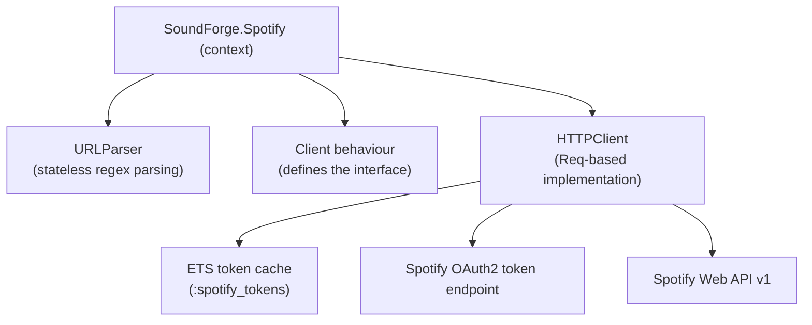
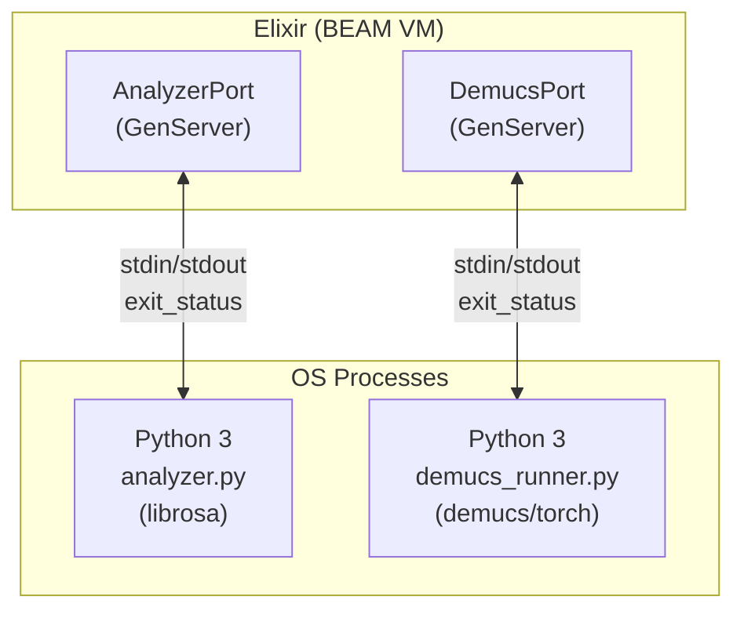
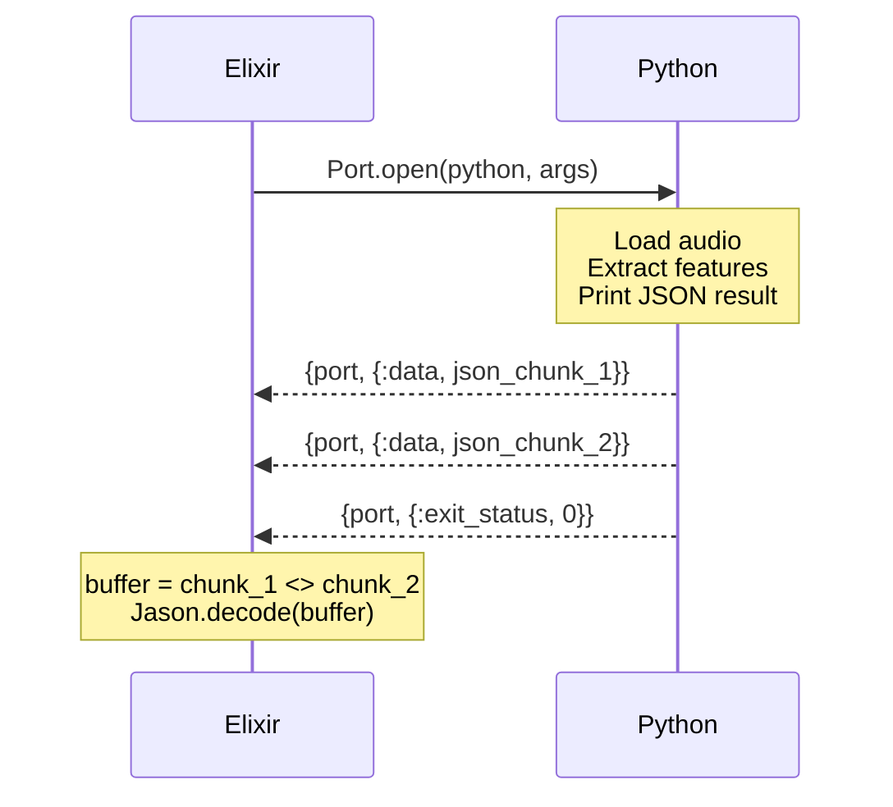
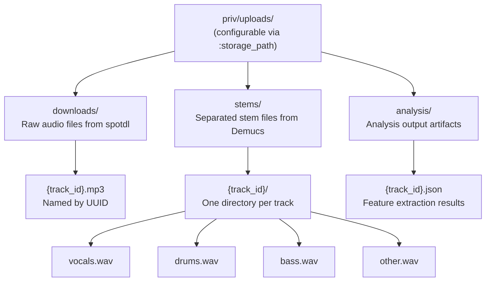
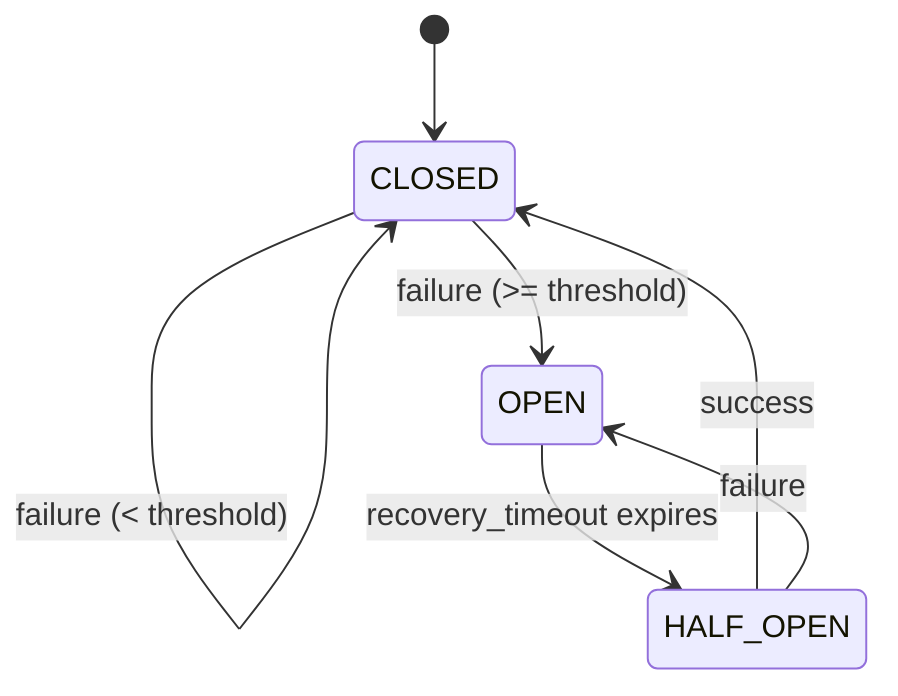

# 07 -- Integration Patterns

## Overview

Sound Forge Alchemy integrates with four external systems: the Spotify Web API (metadata), Python processes via Erlang Ports (audio analysis and stem separation), the spotdl CLI tool (downloading), and the local filesystem (storage). Each integration follows a distinct pattern optimized for its characteristics -- HTTP request/response for Spotify, long-running process communication for Python, CLI execution for downloads, and filesystem operations for storage.

---

## Spotify API Integration

### Architecture



### OAuth2 Client Credentials Flow

The Spotify Web API uses the client credentials grant type, suitable for server-to-server access that does not require user authorization. Credentials are configured via environment variables:

```elixir
# config/runtime.exs
config :sound_forge, :spotify,
  client_id: System.get_env("SPOTIFY_CLIENT_ID"),
  client_secret: System.get_env("SPOTIFY_CLIENT_SECRET")
```

Token acquisition:

```elixir
defp request_token(config) do
  auth = Base.encode64("#{config.client_id}:#{config.client_secret}")

  headers = [
    {"Authorization", "Basic #{auth}"},
    {"Content-Type", "application/x-www-form-urlencoded"}
  ]

  case Req.post("https://accounts.spotify.com/api/token",
         form: %{grant_type: "client_credentials"},
         headers: headers
       ) do
    {:ok, %Req.Response{status: 200, body: %{"access_token" => token}}} ->
      {:ok, token}

    {:ok, %Req.Response{status: status, body: body}} ->
      {:error, {:token_error, status, body}}

    {:error, reason} ->
      {:error, reason}
  end
end
```

### ETS Token Cache

Tokens are cached in a named ETS table with a 3500-second TTL (Spotify tokens expire after 3600 seconds, giving a 100-second safety margin):

```elixir
@token_ttl 3500
@token_table :spotify_tokens

def init do
  :ets.new(@token_table, [:named_table, :public, :set])
rescue
  ArgumentError -> :already_exists
end

defp get_cached_token do
  init()  # idempotent

  case :ets.lookup(@token_table, :access_token) do
    [{:access_token, token, expires_at}] ->
      if System.system_time(:second) < expires_at do
        {:ok, token}
      else
        :error
      end

    [] ->
      :error
  end
end

defp cache_token(token) do
  expires_at = System.system_time(:second) + @token_ttl
  :ets.insert(@token_table, {:access_token, token, expires_at})
end
```

**Why ETS instead of GenServer state?**
- The ETS table survives GenServer restarts (it is owned by the Application process)
- Multiple processes (concurrent Oban workers, LiveView processes) can read the token without serializing through a single GenServer
- Token refresh is lazy -- the first request after expiry triggers a new token fetch

### Req HTTP Client

API requests use `Req.get/2` with bearer token authentication:

```elixir
defp make_api_request(resource_type, id, token) do
  url = "https://api.spotify.com/v1/#{resource_type}/#{id}"

  case Req.get(url, headers: [{"Authorization", "Bearer #{token}"}]) do
    {:ok, %Req.Response{status: 200} = response} ->
      {:ok, response}

    {:ok, response} ->
      {:error, response}

    {:error, reason} ->
      {:error, reason}
  end
end
```

The full token-fetch-and-retry flow chains through `with`:

```elixir
defp fetch_resource(resource_type, id) do
  with {:ok, token} <- get_access_token(),
       {:ok, response} <- make_api_request(resource_type, id, token) do
    {:ok, response.body}
  else
    {:error, %Req.Response{status: status, body: body}} ->
      Logger.error("Spotify API error: #{status} - #{inspect(body)}")
      {:error, {:api_error, status, body}}

    {:error, reason} = error ->
      Logger.error("Spotify request failed: #{inspect(reason)}")
      error
  end
end
```

### URL Parsing

The `URLParser` module handles the various URL formats Spotify uses:

```elixir
@spotify_regex ~r{(?:https?://)?(?:open\.)?spotify\.com/(?:intl-\w+/)?(track|album|playlist)/([a-zA-Z0-9]+)}

def parse(url) when is_binary(url) do
  case Regex.run(@spotify_regex, url) do
    [_, type, id] -> {:ok, %{type: type, id: id}}
    _ -> {:error, :invalid_spotify_url}
  end
end
```

**Supported URL formats**:
- `https://open.spotify.com/track/6rqhFgbbKwnb9MLmUQDhG6`
- `https://open.spotify.com/intl-en/track/6rqhFgbbKwnb9MLmUQDhG6`
- `spotify.com/album/xyz789`
- `https://open.spotify.com/playlist/37i9dQZF1DXcBWIGoYBM5M`

### Testability via Behaviour

The `Client` behaviour allows swapping the HTTP implementation in tests:

```elixir
# lib/sound_forge/spotify/client.ex
defmodule SoundForge.Spotify.Client do
  @callback fetch_track(String.t()) :: {:ok, map()} | {:error, term()}
  @callback fetch_album(String.t()) :: {:ok, map()} | {:error, term()}
  @callback fetch_playlist(String.t()) :: {:ok, map()} | {:error, term()}
end
```

```elixir
# test/support/mocks.ex
Mox.defmock(SoundForge.Spotify.MockClient, for: SoundForge.Spotify.Client)

# config/test.exs
config :sound_forge, :spotify_client, SoundForge.Spotify.MockClient
```

```elixir
# In tests
expect(SoundForge.Spotify.MockClient, :fetch_track, fn "abc123" ->
  {:ok, %{"id" => "abc123", "name" => "Test Song", "artists" => [%{"name" => "Test Artist"}]}}
end)
```

---

## Python Integration via Erlang Ports

### Architecture



### Port Opening

Both ports use `Port.open/2` with `:spawn_executable` for maximum control:

```elixir
Port.open({:spawn_executable, python}, [
  :binary,       # receive data as binaries, not charlists
  :exit_status,  # receive {port, {:exit_status, code}} on process exit
  args: args     # command-line arguments to the Python script
])
```

**Why `:spawn_executable` over `:spawn`?**
- `:spawn_executable` bypasses the shell, preventing injection attacks
- Arguments are passed as a list, not interpolated into a string
- The BEAM manages the OS process lifecycle directly

### JSON Protocol: AnalyzerPort (Request-Response)

The AnalyzerPort uses a single-shot protocol. Python runs, produces one JSON object on stdout, and exits:



Data arrives in chunks (the OS may split stdout into multiple reads). The GenServer accumulates chunks in a buffer and parses the complete JSON only after receiving `exit_status: 0`:

```elixir
def handle_info({port, {:data, data}}, %{port: port, buffer: buffer} = state) do
  {:noreply, %{state | buffer: buffer <> data}}
end

def handle_info({port, {:exit_status, 0}}, %{port: port, caller: caller, buffer: buffer} = state) do
  result = parse_output(buffer)
  GenServer.reply(caller, result)
  {:noreply, reset_state(state)}
end
```

### JSON Lines Protocol: DemucsPort (Streaming)

The DemucsPort uses a JSON-lines protocol where each line is an independent JSON object. This enables real-time progress reporting during long-running stem separation:

```
{"type": "progress", "percent": 10, "message": "Loading model..."}
{"type": "progress", "percent": 30, "message": "Separating sources..."}
{"type": "progress", "percent": 70, "message": "Writing stems..."}
{"type": "result", "stems": {"vocals": "/path", "drums": "/path", ...}, "model": "htdemucs", "output_dir": "/tmp/demucs"}
```

The GenServer splits incoming data on newline boundaries, processing complete lines immediately while buffering incomplete trailing data:

```elixir
def handle_info({port, {:data, data}}, %{port: port, buffer: buffer} = state) do
  new_buffer = buffer <> data
  {lines, remaining} = extract_lines(new_buffer)

  Enum.each(lines, fn line ->
    process_json_line(line, state)
  end)

  {:noreply, %{state | buffer: remaining}}
end

defp extract_lines(buffer) do
  lines = String.split(buffer, "\n")
  case List.pop_at(lines, -1) do
    {incomplete, complete_lines} -> {complete_lines, incomplete || ""}
    nil -> {[], buffer}
  end
end
```

### Timeout Handling

Both ports set explicit timeouts on the `GenServer.call/3`:

```elixir
# AnalyzerPort
@timeout 120_000  # 2 minutes
def analyze(audio_path, features) do
  GenServer.call(__MODULE__, {:analyze, audio_path, features}, @timeout)
end

# DemucsPort
@timeout 300_000  # 5 minutes
def separate(audio_path, opts) do
  GenServer.call(__MODULE__, {:separate, audio_path, model, output_dir, callback}, @timeout)
end
```

If the Python process exceeds the timeout:
1. The calling process receives `** (exit) exited in: GenServer.call(..., 120000)` with reason `:timeout`
2. The GenServer continues running with the port still open
3. Eventually the port exits and the GenServer resets its state

**Planned improvement**: Add a monitor or timer that kills the OS process if it exceeds the timeout:

```elixir
# Planned: force-kill hung Python processes
def handle_call({:analyze, path, features}, from, state) do
  port = open_port(python, script, path, features)
  timer = Process.send_after(self(), {:port_timeout, port}, @timeout)
  {:noreply, %{state | port: port, caller: from, timer: timer}}
end

def handle_info({:port_timeout, port}, %{port: port, caller: caller} = state) do
  Port.close(port)
  GenServer.reply(caller, {:error, :timeout})
  {:noreply, reset_state(state)}
end
```

### Error Recovery

Python script errors are communicated through two channels:

1. **JSON error objects on stdout**: `{"error": "FileNotFoundError", "message": "No such file"}`
2. **Non-zero exit status**: Caught by `:exit_status` handler

The GenServer parses both:

```elixir
defp parse_error(buffer, exit_code) do
  trimmed = String.trim(buffer)

  case Jason.decode(trimmed) do
    {:ok, %{"error" => error_type, "message" => message}} ->
      {:error_from_script, error_type, message}
    {:ok, %{"error" => error}} ->
      {:error_from_script, error}
    _ ->
      {:exit_code, exit_code, trimmed}
  end
end
```

### Python Script Location

Scripts are stored in `priv/python/` and located at runtime via `:code.priv_dir/1`:

```elixir
defp find_analyzer_script do
  script_path = Path.join(:code.priv_dir(:sound_forge), "python/analyzer.py")
  if File.exists?(script_path) do
    {:ok, script_path}
  else
    {:error, {:script_not_found, script_path}}
  end
end
```

This works correctly in both development (pointing to the project's `priv/` directory) and releases (pointing to the release's bundled `priv/` directory).

---

## spotdl CLI Integration

### Architecture

The `DownloadWorker` shells out to `spotdl` via `System.cmd/3`. Unlike the Erlang Port integration, this is a simple synchronous execution -- the worker blocks until the download completes.

```mermaid
flowchart TD
    DW["DownloadWorker.perform/1"]
    SP["spotdl subprocess"]
    RC["{output, exit_code}"]

    DW -->|"System.cmd(\"spotdl\", args, stderr_to_stdout: true)"| SP
    SP -->|"Downloads from YouTube (found via Spotify metadata match)\nConverts to MP3 at specified bitrate\nWrites to output_file"| RC
```

### Command Construction

```elixir
args = [
  spotify_url,            # "https://open.spotify.com/track/abc123"
  "--output", output_file, # "priv/uploads/downloads/{track_id}.mp3"
  "--format", "mp3",
  "--bitrate", quality     # "320k"
]

case System.cmd("spotdl", args, stderr_to_stdout: true) do
  {_output, 0} ->
    {:ok, %{path: output_file, size: File.stat!(output_file).size}}
  {error_output, _code} ->
    {:error, "Download failed: #{error_output}"}
end
```

### Why System.cmd Instead of Erlang Ports?

- spotdl is a one-shot tool: it runs, downloads, and exits
- No streaming protocol needed -- there is no intermediate output to parse
- `stderr_to_stdout: true` captures all output for error reporting
- The Oban worker already provides the concurrency control (3 workers max)

### Planned: Progress Streaming

For future progress reporting, spotdl could be wrapped in a Port instead:

```elixir
# Planned: streaming progress from spotdl
defp execute_download_with_progress(spotify_url, quality, track_id, job_id) do
  port = Port.open({:spawn_executable, System.find_executable("spotdl")}, [
    :binary,
    :exit_status,
    :stderr_to_stdout,
    args: [spotify_url, "--output", output_file, "--format", "mp3", "--bitrate", quality]
  ])

  receive_download_output(port, job_id, "")
end

defp receive_download_output(port, job_id, buffer) do
  receive do
    {^port, {:data, data}} ->
      new_buffer = buffer <> data
      maybe_broadcast_progress(new_buffer, job_id)
      receive_download_output(port, job_id, new_buffer)

    {^port, {:exit_status, 0}} ->
      {:ok, buffer}

    {^port, {:exit_status, code}} ->
      {:error, "spotdl exited with code #{code}: #{buffer}"}
  after
    300_000 ->
      Port.close(port)
      {:error, :download_timeout}
  end
end
```

---

## File System Integration via Storage Module

### Architecture

The `Storage` module provides a thin abstraction over the local filesystem, with configurable base path and three fixed subdirectories:



### Path Resolution

All paths are resolved through the Storage module, never hardcoded:

```elixir
defmodule SoundForge.Storage do
  @default_base_path "priv/uploads"

  def base_path do
    Application.get_env(:sound_forge, :storage_path, @default_base_path)
  end

  def downloads_path, do: Path.join(base_path(), "downloads")
  def stems_path, do: Path.join(base_path(), "stems")
  def analysis_path, do: Path.join(base_path(), "analysis")
end
```

### File Operations

```elixir
# Store a file (copy from source to managed storage)
def store_file(source_path, subdirectory, filename) do
  dest_dir = Path.join(base_path(), subdirectory)
  File.mkdir_p!(dest_dir)
  dest_path = Path.join(dest_dir, filename)

  case File.cp(source_path, dest_path) do
    :ok -> {:ok, dest_path}
    {:error, reason} -> {:error, reason}
  end
end

# Delete with idempotent handling
def delete_file(subdirectory, filename) do
  path = file_path(subdirectory, filename)
  case File.rm(path) do
    :ok -> :ok
    {:error, :enoent} -> :ok    # already gone -- not an error
    {:error, reason} -> {:error, reason}
  end
end
```

### Storage Statistics

```elixir
def stats do
  base = base_path()
  if File.dir?(base) do
    {file_count, total_size} = count_files(base)
    %{
      base_path: base,
      file_count: file_count,
      total_size_bytes: total_size,
      total_size_mb: Float.round(total_size / (1024 * 1024), 2)
    }
  else
    %{base_path: base, file_count: 0, total_size_bytes: 0, total_size_mb: 0.0}
  end
end
```

### Planned: Serving Files

Files are served to the browser through the `FileController`, which maps URL paths to storage locations:

```elixir
# From router.ex
get "/files/*path", FileController, :serve
```

---

## Circuit Breaker Pattern (Planned)

External service calls (Spotify API, spotdl) can fail due to rate limiting, network issues, or service outages. A circuit breaker prevents cascading failures by short-circuiting requests when a threshold of failures is reached.

### Planned Implementation

```elixir
defmodule SoundForge.CircuitBreaker do
  use GenServer

  @failure_threshold 5
  @recovery_timeout 30_000  # 30 seconds

  defstruct state: :closed, failure_count: 0, last_failure: nil

  def call(service, fun) do
    case GenServer.call(__MODULE__, {:check, service}) do
      :ok ->
        case fun.() do
          {:ok, _} = result ->
            GenServer.cast(__MODULE__, {:success, service})
            result

          {:error, _} = error ->
            GenServer.cast(__MODULE__, {:failure, service})
            error
        end

      :open ->
        {:error, {:circuit_open, service}}
    end
  end

  @impl true
  def handle_call({:check, service}, _from, state) do
    breaker = Map.get(state, service, %__MODULE__{})

    case breaker.state do
      :closed ->
        {:reply, :ok, state}

      :open ->
        if System.monotonic_time(:millisecond) - breaker.last_failure > @recovery_timeout do
          # Half-open: allow one request through
          {:reply, :ok, Map.put(state, service, %{breaker | state: :half_open})}
        else
          {:reply, :open, state}
        end

      :half_open ->
        {:reply, :ok, state}
    end
  end

  @impl true
  def handle_cast({:success, service}, state) do
    {:noreply, Map.put(state, service, %__MODULE__{})}
  end

  @impl true
  def handle_cast({:failure, service}, state) do
    breaker = Map.get(state, service, %__MODULE__{})
    new_count = breaker.failure_count + 1

    new_breaker =
      if new_count >= @failure_threshold do
        %{breaker | state: :open, failure_count: new_count, last_failure: System.monotonic_time(:millisecond)}
      else
        %{breaker | failure_count: new_count}
      end

    {:noreply, Map.put(state, service, new_breaker)}
  end
end
```

Usage in the Spotify context:

```elixir
def fetch_metadata(url) do
  with {:ok, %{type: type, id: id}} <- URLParser.parse(url) do
    CircuitBreaker.call(:spotify, fn ->
      case type do
        "track" -> spotify_client().fetch_track(id)
        "album" -> spotify_client().fetch_album(id)
        "playlist" -> spotify_client().fetch_playlist(id)
      end
    end)
  end
end
```

### Circuit States



---

## Webhook Patterns (Planned)

For future integrations (e.g., notifying external services when processing completes), a webhook dispatch system is planned:

### Planned Architecture

```elixir
defmodule SoundForge.Webhooks do
  @moduledoc """
  Webhook dispatch for external service notifications.
  """

  alias SoundForge.Repo

  def dispatch(event, payload) do
    # Find all registered webhooks for this event
    webhooks = list_webhooks_for_event(event)

    Enum.each(webhooks, fn webhook ->
      %{
        webhook_id: webhook.id,
        event: event,
        payload: payload,
        url: webhook.url
      }
      |> SoundForge.Jobs.WebhookWorker.new()
      |> Oban.insert()
    end)
  end
end

defmodule SoundForge.Jobs.WebhookWorker do
  use Oban.Worker,
    queue: :webhooks,
    max_attempts: 5

  @impl Oban.Worker
  def perform(%Oban.Job{args: %{"url" => url, "event" => event, "payload" => payload}}) do
    body = Jason.encode!(%{event: event, payload: payload, timestamp: DateTime.utc_now()})

    case Req.post(url,
           body: body,
           headers: [{"Content-Type", "application/json"}],
           receive_timeout: 10_000
         ) do
      {:ok, %Req.Response{status: status}} when status in 200..299 ->
        :ok

      {:ok, %Req.Response{status: status}} ->
        {:error, "Webhook returned status #{status}"}

      {:error, reason} ->
        {:error, inspect(reason)}
    end
  end
end
```

### Planned Events

| Event | Payload | Use Case |
|-------|---------|----------|
| `track.downloaded` | `%{track_id, file_path, file_size}` | Trigger external processing |
| `track.processed` | `%{track_id, stems: [...]}` | Notify DAW integrations |
| `track.analyzed` | `%{track_id, tempo, key, energy}` | Feed music databases |
| `job.failed` | `%{job_id, worker, error}` | Alert monitoring systems |

---

## Integration Summary

| Integration | Transport | Protocol | Timeout | Error Strategy |
|-------------|-----------|----------|---------|---------------|
| Spotify API | HTTPS (Req) | REST JSON | Req default (30s) | ETS token cache, error tuples |
| AnalyzerPort | Erlang Port | JSON single-shot | 2 min | Exit status parsing, GenServer reset |
| DemucsPort | Erlang Port | JSON lines (streaming) | 5 min | Exit status parsing, progress callbacks |
| spotdl CLI | System.cmd | CLI exit code + stdout | Oban job timeout | Oban retry (3 attempts) |
| Storage | Local filesystem | File.cp/rm/stat | N/A | Error tuples, idempotent delete |
| Circuit Breaker | Internal GenServer | State machine | 30s recovery | Threshold-based tripping |
| Webhooks | HTTPS (Req) | POST JSON | 10s per request | Oban retry (5 attempts) |
