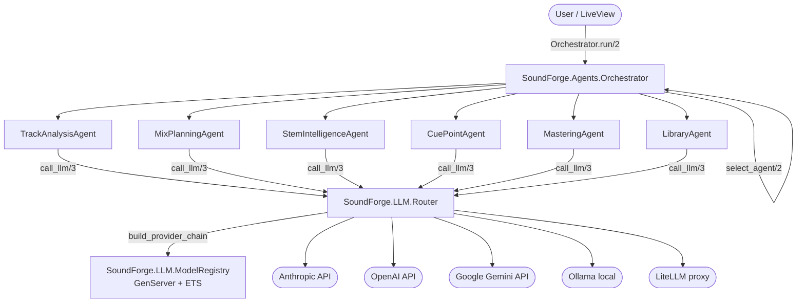

[Home](../index.md) > [Architecture](index.md) > Agent System

# Agent System

## Table of Contents

- [Overview](#overview)
- [Architecture Diagram](#architecture-diagram)
- [Orchestrator](#orchestrator)
- [Specialist Agents](#specialist-agents)
- [Capability Map](#capability-map)
- [Instruction Routing](#instruction-routing)
- [Pipeline Execution](#pipeline-execution)
- [Context and Result Types](#context-and-result-types)
- [Agent Behaviour](#agent-behaviour)
- [LLM Routing from Agents](#llm-routing-from-agents)
- [Usage Examples](#usage-examples)

---

## Overview

Sound Forge Alchemy includes a multi-agent system for music intelligence. Six specialist agents handle different domains of audio knowledge. A routing `Orchestrator` selects the best agent (or pipeline of agents) for any given instruction.

All agents communicate with configurable LLM backends — Anthropic, OpenAI, Google Gemini, Ollama, Azure OpenAI, or LiteLLM. See [LLM Providers](llm-providers.md) for provider configuration.

Agents are functional modules, not OTP processes. Each receives a `%Context{}` struct and returns `{:ok, %Result{}}` or `{:error, reason}`.

---

## Architecture Diagram



---

## Orchestrator

**Module:** `SoundForge.Agents.Orchestrator`

**File:** `lib/sound_forge/agents/orchestrator.ex`

The Orchestrator is the single entry point for all agentic work. It:

1. Inspects the incoming `Context.instruction` and optional `:task` hint
2. Selects the best specialist agent (or a pipeline of agents)
3. Executes the agent(s) sequentially or in parallel as needed
4. Merges and returns a unified `Result`

### Entry Points

```elixir
# Direct dispatch with task hint
Orchestrator.run(%Context{instruction: "Analyse the key", track_id: id}, task: :track_analysis)

# Auto-routing — instruction keyword matching
Orchestrator.run(%Context{instruction: "Plan a set with these 5 tracks", track_ids: ids})

# Sequential pipeline
Orchestrator.pipeline(%Context{...}, [TrackAnalysisAgent, MixPlanningAgent])
```

### `run/2` — Single Agent Dispatch

```
Orchestrator.run(%Context{}, opts) -> {:ok, %Result{}} | {:error, reason}
```

Options:
- `:task` — atom capability hint (e.g. `:track_analysis`) for direct dispatch. If omitted, the Orchestrator matches the instruction text against keyword patterns.

Errors from the selected agent are caught and returned as `{:error, reason}` — the Orchestrator itself never raises.

### `pipeline/3` — Sequential Multi-Agent Execution

```
Orchestrator.pipeline(%Context{}, [Module, ...], opts) -> {:ok, [%Result{}]} | {:error, reason}
```

Each agent receives the previous agent's result data merged into its context. The pipeline halts on the first error and returns `{:error, reason}`.

On success, returns `{:ok, [%Result{}, ...]}` — all intermediate results in order.

### `select_agent/2` — Preview Without Execution

```
Orchestrator.select_agent(%Context{}, opts) -> module()
```

Returns the module that would be selected without running it. Useful for UI previews and testing.

### `capability_map/0`

```
Orchestrator.capability_map() -> [{atom(), module()}]
```

Returns the full ordered capability → agent module list (20 entries).

---

## Specialist Agents

### TrackAnalysisAgent

**Module:** `SoundForge.Agents.TrackAnalysisAgent`

**File:** `lib/sound_forge/agents/track_analysis_agent.ex`

Analyzes individual track characteristics. Default agent when no other instruction pattern matches.

**Capabilities:** `:track_analysis`, `:key_detection`, `:bpm_detection`, `:energy_analysis`, `:harmonic_analysis`

**Preferred traits:** `[task: :analysis, speed: :balanced]`

**Instruction keywords (regex):** `analys`, `key`, `bpm`, `tempo`, `chord`, `harmonic`, `genre`

**System prompt summary:** Expert music analyst. Detects key + confidence, BPM, rhythmic feel, energy profile per section, chord progressions, genre/sub-genre. Flags uncertainty explicitly.

**Example prompt/response:**

```
Instruction: "What key and tempo is this track?"
Context data: {"tempo": 128.0, "key": "A minor", "energy": 0.74}

Response: "This track is in A minor at 128 BPM with moderate-high energy throughout.
The rhythmic feel is straight (no swing). Key confidence: high."
```

---

### MixPlanningAgent

**Module:** `SoundForge.Agents.MixPlanningAgent`

**File:** `lib/sound_forge/agents/mix_planning_agent.ex`

Plans DJ set sequences and mix transitions using Camelot key compatibility.

**Capabilities:** `:mix_planning`, `:track_sequencing`, `:transition_advice`, `:energy_flow`, `:key_compatibility`

**Preferred traits:** `[task: :generation, speed: :balanced]`

**Instruction keywords (regex):** `mix`, `set`, `playlist`, `transition`, `sequence`, `order`

**System prompt summary:** Expert DJ and harmonic mixing assistant. Uses the Camelot wheel for key compatibility (same position, ±1 number same letter, or same number opposite letter). Manages energy curves, BPM alignment strategies, per-transition EQ/effects advice. Returns JSON when machine-readable format is requested.

---

### StemIntelligenceAgent

**Module:** `SoundForge.Agents.StemIntelligenceAgent`

**File:** `lib/sound_forge/agents/stem_intelligence_agent.ex`

Provides intelligence about separated stems — quality assessment, artifact identification, model recommendations.

**Capabilities:** `:stem_analysis`, `:stem_quality_assessment`, `:stem_recommendations`, `:loop_extraction_advice`

**Preferred traits:** `[task: :analysis, speed: :fast]`

**Instruction keywords (regex):** `stem`, `vocal`, `drum`, `bass`, `isolat`

**System prompt summary:** Audio stem separation expert. Knows Demucs models (htdemucs, htdemucs_ft, htdemucs_6s, mdx_extra) and lalal.ai stem types. Evaluates quality per stem (bleed, reverb tails, transient smearing), identifies isolation artifacts, recommends optimal model for source material, suggests creative uses.

---

### CuePointAgent

**Module:** `SoundForge.Agents.CuePointAgent`

**File:** `lib/sound_forge/agents/cue_point_agent.ex`

Detects and recommends cue points, loop regions, and structural markers.

**Capabilities:** `:cue_point_analysis`, `:loop_region_detection`, `:drop_detection`, `:phrase_boundary_detection`

**Preferred traits:** `[task: :analysis, speed: :fast]`

**Instruction keywords (regex):** `cue`, `loop`, `drop`, `phrase`, `marker`

**System prompt summary:** DJ analyst specializing in cue point placement. Understands 4/8/16/32-bar phrase structure, DJ cue conventions (hot cues, memory cues, loop in/out), drop detection via energy buildup patterns. Given beats/BPM/energy/RMS data, identifies structural moments and suggests specific cue timestamps (seconds) with labels, loop regions with bar lengths, and flags irregular structures.

---

### MasteringAgent

**Module:** `SoundForge.Agents.MasteringAgent`

**File:** `lib/sound_forge/agents/mastering_agent.ex`

Provides mastering and mixing advice based on audio analysis data.

**Capabilities:** `:mastering_advice`, `:loudness_analysis`, `:dynamic_range_advice`, `:eq_recommendations`, `:compression_advice`

**Preferred traits:** `[task: :analysis, speed: :balanced]`

**Instruction keywords (regex):** `master`, `loud`, `lufs`, `dynamic`, `eq`, `compress`

**System prompt summary:** Professional mastering engineer. Knows LUFS standards (Spotify -14 LUFS, Apple Music -16 LUFS, EBU R128 -23 LUFS, club playback -6 LUFS), dynamic range, EQ, compression, stereo image. Provides specific target values (e.g., `-1 dBTP ceiling`).

---

### LibraryAgent

**Module:** `SoundForge.Agents.LibraryAgent`

**File:** `lib/sound_forge/agents/library_agent.ex`

Searches the track library, finds similar tracks, and curates playlists.

**Capabilities:** `:library_search`, `:track_recommendations`, `:playlist_curation`, `:genre_classification`, `:mood_tagging`

**Preferred traits:** `[task: :generation, speed: :fast]`

**Instruction keywords (regex):** `librar`, `recommend`, `find`, `search`, `similar`, `tag`, `genre`

**System prompt summary:** Expert music librarian and curator. Deep knowledge of genre taxonomies, subgenres, eras, regional styles, mood categorization, BPM/key-based organization, and musical relationships across genres.

---

## Capability Map

The Orchestrator uses this ordered mapping for `:task` hint dispatch. First match wins.

| Capability | Agent |
|-----------|-------|
| `:track_analysis` | TrackAnalysisAgent |
| `:key_detection` | TrackAnalysisAgent |
| `:bpm_detection` | TrackAnalysisAgent |
| `:energy_analysis` | TrackAnalysisAgent |
| `:harmonic_analysis` | TrackAnalysisAgent |
| `:mix_planning` | MixPlanningAgent |
| `:track_sequencing` | MixPlanningAgent |
| `:transition_advice` | MixPlanningAgent |
| `:key_compatibility` | MixPlanningAgent |
| `:stem_analysis` | StemIntelligenceAgent |
| `:stem_recommendations` | StemIntelligenceAgent |
| `:loop_extraction_advice` | StemIntelligenceAgent |
| `:cue_point_analysis` | CuePointAgent |
| `:loop_region_detection` | CuePointAgent |
| `:drop_detection` | CuePointAgent |
| `:mastering_advice` | MasteringAgent |
| `:loudness_analysis` | MasteringAgent |
| `:library_search` | LibraryAgent |
| `:track_recommendations` | LibraryAgent |
| `:playlist_curation` | LibraryAgent |

---

## Instruction Routing

When no `:task` hint is provided, the Orchestrator matches the instruction text against regex patterns (case-insensitive, word-boundary anchored):

| Pattern | Agent |
|---------|-------|
| `\b(analys\|key\|bpm\|tempo\|chord\|harmonic\|genre)\b` | TrackAnalysisAgent |
| `\b(mix\|set\|playlist\|transition\|sequence\|order)\b` | MixPlanningAgent |
| `\b(stem\|vocal\|drum\|bass\|isolat)\b` | StemIntelligenceAgent |
| `\b(cue\|loop\|drop\|phrase\|marker)\b` | CuePointAgent |
| `\b(master\|loud\|lufs\|dynamic\|eq\|compress)\b` | MasteringAgent |
| `\b(librar\|recommend\|find\|search\|similar\|tag\|genre)\b` | LibraryAgent |

If no pattern matches, the default agent is `TrackAnalysisAgent`.

Pattern matching is implemented in `agent_for_instruction/1` using `Enum.find_value/2` on `@instruction_patterns`. The first pattern that matches wins.

---

## Pipeline Execution

In a pipeline, each agent's result data is merged into the next agent's context via `merge_result_into_context/2`:

```elixir
# Results chain: TrackAnalysisAgent result data feeds into MixPlanningAgent context
Orchestrator.pipeline(ctx, [TrackAnalysisAgent, MixPlanningAgent])
```

Pipeline merging rules (from `merge_result_into_context/2`):
- If `result.data` is nil, the context is unchanged
- If `ctx.data` is nil and `result.data` is a map, `ctx.data` is set to `result.data`
- If both are maps, they are merged with `Map.merge(existing, incoming)` — incoming keys win
- Otherwise, the context is unchanged

The pipeline returns `{:ok, [%Result{}, ...]}` with all intermediate results, or `{:error, reason}` on the first failure (using `Enum.reduce_while/3`).

---

## Context and Result Types

### `SoundForge.Agents.Context`

**File:** `lib/sound_forge/agents/context.ex`

```elixir
@enforce_keys [:instruction]
defstruct [
  :user_id,           # User triggering the run — used for LLM provider routing
  :track_id,          # Optional single track ID
  :track_ids,         # Optional list of track IDs
  :instruction,       # Natural language instruction (required)
  :data,              # Arbitrary domain data map (e.g. analysis results)
  :tools,             # List of %SoundForge.Agents.Tool{} for tool calls
  :conversation_history, # Prior messages for multi-turn interactions
  messages: []        # Accumulator for current-turn messages
]
```

Constructor: `Context.new("instruction", opts_keyword_list)`.

Helper: `Context.append_message(ctx, message_map)` appends to `:messages`.

Helper: `Context.llm_tool_specs(ctx)` returns tools formatted as LLM API tool-call specs, or `nil` if no tools.

### `SoundForge.Agents.Result`

**File:** `lib/sound_forge/agents/result.ex`

```elixir
@enforce_keys [:agent]
defstruct [
  :agent,     # Module that produced the result
  :content,   # Primary text output from the LLM (String.t | nil)
  :data,      # Structured data map — merged into next pipeline stage (map | nil)
  :usage,     # Token usage info from LLM — %{input_tokens: n, output_tokens: n} (map | nil)
  :error,     # Error string or term on failure (nil on success)
  success?: true  # Boolean — false when agent errored
]
```

Constructors:
- `Result.ok(agent_module, content, opts)` — builds a success result; accepts `data:` and `usage:` in opts
- `Result.error(agent_module, reason)` — builds a failure result with `success?: false`

Predicates: `Result.success?/1`, `Result.failure?/1`.

---

## Agent Behaviour

**Module:** `SoundForge.Agents.Agent`

**File:** `lib/sound_forge/agents/agent.ex`

All specialist agents implement this behaviour and `use SoundForge.Agents.Agent`:

```elixir
@callback name() :: String.t()
@callback description() :: String.t()
@callback capabilities() :: [atom()]
@callback preferred_traits() :: keyword()
@callback system_prompt() :: String.t()
@callback run(Context.t(), keyword()) :: {:ok, Result.t()} | {:error, term()}
```

The `use SoundForge.Agents.Agent` macro injects three helper functions into every agent:

| Helper | Purpose |
|--------|---------|
| `call_llm(user_id, messages, opts)` | Route LLM call using agent's `preferred_traits/0` |
| `call_llm_with_provider(user_id, provider_type, messages, opts)` | Force a specific provider type |
| `format_messages(system_content, user_messages)` | Build message list, prepending system prompt |

The `format_messages/2` `system_content` argument:
- `nil` — use `system_prompt/0`
- `:none` — omit system message
- binary string — use as custom system message

---

## LLM Routing from Agents

When an agent calls `call_llm/3`, the flow is:

1. `call_llm` calls `build_task_spec(preferred_traits(), opts)` to build a `task_spec` map
2. `Router.route(user_id, messages, task_spec)` is called
3. The Router calls `Providers.all_available_providers(user_id)` to build a fallback chain
4. LiteLLM is prioritized in the chain; remaining providers are sorted by priority and health
5. If `:features` in `task_spec`, providers are filtered to those whose default model supports the features
6. Chain is attempted up to `@max_fallback_attempts` (4) providers
7. On success, provider health is updated to `:healthy`; on failure, to `:unreachable`

Agent `preferred_traits` `speed` values map to Router `prefer` values:
- `:fast` → `:speed`
- `:slow` → `:quality`
- `:balanced` → `nil` (no preference)

---

## Usage Examples

```elixir
alias SoundForge.Agents.{Orchestrator, Context}

# Analyze a single track's key and tempo
{:ok, result} = Orchestrator.run(
  Context.new("What key and tempo is this track?", track_id: track_id, user_id: user_id),
  task: :track_analysis
)
IO.puts(result.content)

# Auto-route by instruction keywords (routes to MixPlanningAgent)
{:ok, result} = Orchestrator.run(
  Context.new("Create an optimal set ordering for a progressive house mix",
    track_ids: [id1, id2, id3, id4, id5],
    user_id: user_id
  )
)

# Preview which agent would be selected (no LLM call)
module = Orchestrator.select_agent(
  Context.new("Suggest cue points for this drop"),
  []
)
# => SoundForge.Agents.CuePointAgent

# Sequential pipeline: analyze then generate mastering advice
{:ok, [analysis_result, mastering_result]} = Orchestrator.pipeline(
  Context.new("Analyze this track and give mastering advice",
    track_id: track_id,
    user_id: user_id
  ),
  [SoundForge.Agents.TrackAnalysisAgent, SoundForge.Agents.MasteringAgent]
)

# Force a specific provider
{:ok, result} = SoundForge.Agents.TrackAnalysisAgent.call_llm_with_provider(
  user_id,
  :anthropic,
  messages,
  []
)
```

---

## See Also

- [LLM Providers](llm-providers.md)
- [AI Agents Feature Guide](../features/ai-agents.md)
- [Architecture Overview](index.md)

---

[← Stack Details](stack.md) | [Next: LLM Providers →](llm-providers.md)
