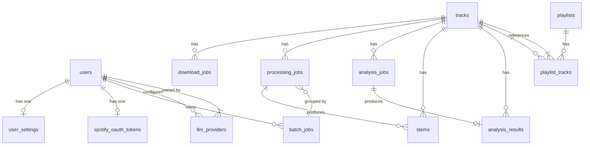
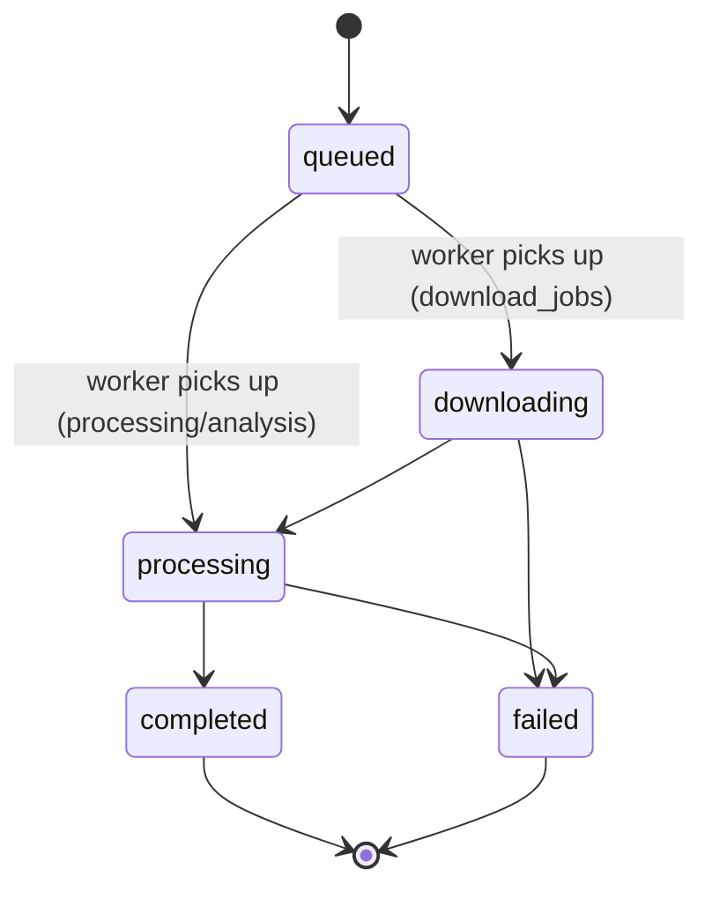

[Home](../index.md) > [Architecture](index.md) > Database Schema

# Database Schema

## Table of Contents

- [Overview](#overview)
- [Entity Relationships](#entity-relationships)
- [Accounts Tables](#accounts-tables)
- [Music Tables](#music-tables)
- [Job Tables](#job-tables)
- [LLM Provider Table](#llm-provider-table)
- [Oban Jobs Table](#oban-jobs-table)
- [Indexes and Constraints](#indexes-and-constraints)
- [Migration Strategy](#migration-strategy)

---

## Overview

Sound Forge Alchemy uses PostgreSQL 14+ with Ecto 3.13. All primary keys are `binary_id` (UUID v4) except `users` (integer) and Oban tables (bigserial). Oban uses the same database for job storage in `oban_jobs`. API keys and OAuth tokens are encrypted at rest using `SoundForge.Vault` (AES-256-GCM via `Cloak.Ecto`).

### Key Design Decisions

- **All PKs are UUID v4** (`binary_id`) except `users` (legacy integer PK) and Oban system tables
- **Job tables** share a common 5-state machine: `:queued` → `:downloading`/`:processing` → `:completed` | `:failed`
- **Stem file paths** are stored as relative paths (e.g. `stems/track_id/vocals.wav`) to produce clean `/files/stems/...` URLs
- **Encrypted fields**: `user_settings.lalalai_api_key`, `llm_providers.api_key`, `spotify_oauth_tokens.access_token`, `spotify_oauth_tokens.refresh_token` — all use `SoundForge.Encrypted.Binary` / `SoundForge.Vault` (AES-256-GCM)

---

## Entity Relationships



---

## Accounts Tables

### `users`

Generated by `phx.gen.auth`. Integer PK (legacy; all other tables use UUID).

| Column | Type | Constraints | Description |
|--------|------|-------------|-------------|
| `id` | `bigint` | PK, serial | Auto-increment integer ID |
| `email` | `varchar(160)` | unique, **required** | User email address |
| `hashed_password` | `varchar` | — | Bcrypt hash (redacted in logs) |
| `role` | `varchar` | enum, default: `user` | `user`, `pro`, `enterprise`, `admin`, `super_admin`, `platform_admin` |
| `status` | `varchar` | enum, default: `active` | `active`, `suspended`, `banned` |
| `confirmed_at` | `utc_datetime` | — | Email confirmation timestamp |
| `inserted_at` | `utc_datetime` | not null | |
| `updated_at` | `utc_datetime` | not null | |

**Ecto module:** `SoundForge.Accounts.User`

Role hierarchy (ascending privilege): `user` → `pro` → `enterprise` → `admin` → `super_admin` → `platform_admin`

### `users_tokens`

Generated by `phx.gen.auth`. Stores session, confirmation, and reset tokens.

| Column | Type | Description |
|--------|------|-------------|
| `id` | `bigint` | PK |
| `user_id` | `bigint` | FK → users |
| `token` | `bytea` | Secure random bytes |
| `context` | `varchar` | `session`, `confirm`, `reset_password` |
| `sent_to` | `varchar` | Email address (for email tokens) |
| `inserted_at` | `utc_datetime` | |

### `user_settings`

Per-user preference overrides. All fields are nullable — nil means "use the global default from Application config".

| Column | Type | Description |
|--------|------|-------------|
| `id` | `bigint` | PK |
| `user_id` | `bigint` | FK → users, unique |
| `download_quality` | `varchar` | `128k`, `192k`, `256k`, `320k` |
| `audio_format` | `varchar` | `mp3`, `flac`, `wav`, `ogg` |
| `output_directory` | `varchar` | Override download directory |
| `ytdlp_search_depth` | `integer` | 1–20 |
| `ytdlp_preferred_format` | `varchar` | yt-dlp format string |
| `ytdlp_bitrate` | `varchar` | yt-dlp bitrate |
| `demucs_model` | `varchar` | `htdemucs`, `htdemucs_ft`, `htdemucs_6s`, `mdx_extra` |
| `demucs_output_format` | `varchar` | `wav`, `flac`, `mp3` |
| `demucs_device` | `varchar` | `cpu`, `cuda` |
| `demucs_timeout` | `integer` | Seconds |
| `analysis_features` | `varchar[]` | Array: `tempo`, `key`, `energy`, `spectral` |
| `analyzer_timeout` | `integer` | Seconds |
| `storage_path` | `varchar` | Override storage root |
| `max_file_age_days` | `integer` | File retention |
| `retention_days` | `integer` | Retention policy |
| `tracks_per_page` | `integer` | 1–100 |
| `max_upload_size` | `integer` | Bytes |
| `lalalai_api_key` | `bytea` | **Encrypted** (Cloak AES-GCM-256) |
| `lalalai_splitter` | `varchar` | `andromeda`, `perseus`, `orion`, `phoenix`, `lyra` |
| `lalalai_dereverb` | `boolean` | Enable de-reverb |
| `lalalai_extraction_level` | `varchar` | `mild`, `normal`, `clear_cut`, `deep_extraction` |
| `lalalai_output_format` | `varchar` | `mp3`, `wav`, `flac`, `aac`, `ogg` |
| `debug_mode` | `boolean` | default: false |
| `inserted_at` | `utc_datetime` | |
| `updated_at` | `utc_datetime` | |

**Ecto module:** `SoundForge.Accounts.UserSettings`

### `spotify_oauth_tokens`

Encrypted Spotify OAuth2 tokens. One per user.

| Column | Type | Description |
|--------|------|-------------|
| `id` | `bigint` | PK |
| `user_id` | `bigint` | FK → users, unique |
| `access_token` | `bytea` | **Encrypted** at rest |
| `refresh_token` | `bytea` | **Encrypted** at rest |
| `token_type` | `varchar` | default: `Bearer` |
| `expires_at` | `utc_datetime` | Expiration timestamp |
| `scopes` | `varchar` | Space-delimited OAuth scopes |
| `inserted_at` | `utc_datetime` | |
| `updated_at` | `utc_datetime` | |

**Ecto module:** `SoundForge.Accounts.SpotifyOAuthToken`

Helper: `SpotifyOAuthToken.expired?/1` — returns true if `expires_at` is in the past.

---

## Music Tables

### `tracks`

The root entity. Represents a single piece of audio, typically sourced from Spotify.

| Column | Type | Constraints | Description |
|--------|------|-------------|-------------|
| `id` | `uuid` | PK, not null | UUID v4 primary key |
| `spotify_id` | `varchar` | unique | Spotify track identifier |
| `spotify_url` | `varchar` | — | Full Spotify URL |
| `title` | `varchar(500)` | **required**, min 1 | Track title |
| `artist` | `varchar` | — | Primary artist name |
| `album` | `varchar` | — | Album name |
| `album_art_url` | `varchar` | — | URL to album artwork |
| `duration` | `integer` | > 0 | Duration in seconds |
| `user_id` | `integer` | FK → users | Owning user |
| `inserted_at` | `utc_datetime` | not null | |
| `updated_at` | `utc_datetime` | not null | |

Virtual field: `download_status` (`:string`) — populated by `list_tracks` query with the latest download job status; not persisted.

**Ecto module:** `SoundForge.Music.Track`

Associations:
- `has_many :download_jobs`
- `has_many :processing_jobs`
- `has_many :analysis_jobs`
- `has_many :stems`
- `has_many :analysis_results`
- `has_many :playlist_tracks`
- `has_many :playlists, through: [:playlist_tracks, :playlist]`

### `stems`

Individual audio stem files produced by processing jobs.

| Column | Type | Constraints | Description |
|--------|------|-------------|-------------|
| `id` | `uuid` | PK, not null | UUID v4 primary key |
| `processing_job_id` | `uuid` | FK, **required** (except DAW exports) | Parent ProcessingJob |
| `track_id` | `uuid` | FK, **required** | Parent Track |
| `stem_type` | `varchar` | enum, **required** | See stem types below |
| `file_path` | `varchar` | — | Relative filesystem path (e.g. `stems/track_id/vocals.wav`) |
| `file_size` | `integer` | — | File size in bytes |
| `options` | `jsonb` | default: `{}` | Additional options map |
| `source` | `varchar` | default: `local` | `local` (Demucs) or `lalalai` |
| `inserted_at` | `utc_datetime` | not null | |
| `updated_at` | `utc_datetime` | not null | |

**Stem type enum values:**

| Value | Source |
|-------|--------|
| `vocals` | Demucs + lalal.ai |
| `drums` | Demucs + lalal.ai |
| `bass` | Demucs + lalal.ai |
| `other` | Demucs |
| `guitar` | Demucs (htdemucs_6s) |
| `piano` | Demucs (htdemucs_6s) |
| `electric_guitar` | lalal.ai |
| `acoustic_guitar` | lalal.ai |
| `synth` | lalal.ai |
| `strings` | lalal.ai |
| `wind` | lalal.ai |

**Ecto module:** `SoundForge.Music.Stem`

Two changesets: `changeset/2` (requires `processing_job_id`), `export_changeset/2` (DAW exports, no `processing_job_id`).

### `analysis_results`

Structured audio feature analysis output from librosa.

| Column | Type | Constraints | Description |
|--------|------|-------------|-------------|
| `id` | `uuid` | PK, not null | UUID v4 primary key |
| `track_id` | `uuid` | FK, **required** | Parent Track |
| `analysis_job_id` | `uuid` | FK, **required** | Parent AnalysisJob |
| `tempo` | `float` | — | BPM (beats per minute) |
| `key` | `varchar` | — | Musical key, e.g., `"C major"` |
| `energy` | `float` | — | Normalized RMS energy (0.0–1.0) |
| `spectral_centroid` | `float` | — | Spectral centroid in Hz |
| `spectral_rolloff` | `float` | — | Spectral rolloff in Hz |
| `zero_crossing_rate` | `float` | — | Zero crossing rate (0.0–1.0) |
| `features` | `jsonb` | — | Extended features map (MFCC, chroma, beats, segments) |
| `inserted_at` | `utc_datetime` | not null | |
| `updated_at` | `utc_datetime` | not null | |

**Ecto module:** `SoundForge.Music.AnalysisResult`

### `playlists`

User playlists, optionally synced from Spotify.

| Column | Type | Constraints | Description |
|--------|------|-------------|-------------|
| `id` | `uuid` | PK, not null | UUID v4 primary key |
| `name` | `varchar(500)` | **required**, min 1 | Playlist name |
| `description` | `varchar` | — | Optional description |
| `spotify_id` | `varchar` | unique per user | Spotify playlist identifier |
| `spotify_url` | `varchar` | — | Full Spotify URL |
| `cover_art_url` | `varchar` | — | Cover art image URL |
| `source` | `varchar` | default: `manual` | `spotify`, `manual`, `import` |
| `user_id` | `integer` | FK → users | Owning user |
| `inserted_at` | `utc_datetime` | not null | |
| `updated_at` | `utc_datetime` | not null | |

Unique constraint: `(spotify_id, user_id)`.

**Ecto module:** `SoundForge.Music.Playlist`

Associations: `has_many :playlist_tracks`, `has_many :tracks, through: [:playlist_tracks, :track]`.

### `playlist_tracks`

Join table between playlists and tracks with ordering support.

| Column | Type | Constraints | Description |
|--------|------|-------------|-------------|
| `id` | `uuid` | PK, not null | UUID v4 primary key |
| `playlist_id` | `uuid` | FK, **required** | Parent Playlist |
| `track_id` | `uuid` | FK, **required** | Referenced Track |
| `position` | `integer` | — | Order within playlist |
| `inserted_at` | `utc_datetime` | not null | |
| `updated_at` | `utc_datetime` | not null | |

Unique constraint: `(playlist_id, track_id)`.

**Ecto module:** `SoundForge.Music.PlaylistTrack`

---

## Job Tables

All job tables share a common status state machine:



### `download_jobs`

Tracks audio download progress via spotdl.

| Column | Type | Constraints | Description |
|--------|------|-------------|-------------|
| `id` | `uuid` | PK, not null | UUID v4 |
| `track_id` | `uuid` | FK, **required** | Parent Track |
| `status` | `varchar` | enum, default: `queued` | `queued`, `downloading`, `processing`, `completed`, `failed` |
| `progress` | `integer` | default: 0, 0–100 | Completion percentage |
| `output_path` | `varchar` | — | Path to downloaded audio file |
| `file_size` | `integer` | — | Downloaded file size in bytes |
| `error` | `text` | — | Error message on failure |
| `inserted_at` | `utc_datetime` | not null | |
| `updated_at` | `utc_datetime` | not null | |

**Ecto module:** `SoundForge.Music.DownloadJob`

### `processing_jobs`

Tracks stem separation via Demucs or lalal.ai.

| Column | Type | Constraints | Description |
|--------|------|-------------|-------------|
| `id` | `uuid` | PK, not null | UUID v4 |
| `track_id` | `uuid` | FK, **required** | Parent Track |
| `batch_job_id` | `uuid` | FK | Parent BatchJob (optional) |
| `model` | `varchar` | default: `htdemucs` | Demucs model name |
| `engine` | `varchar` | default: `demucs` | `demucs` or `lalalai` |
| `status` | `varchar` | enum, default: `queued` | Job status |
| `progress` | `integer` | default: 0, 0–100 | |
| `output_path` | `varchar` | — | Directory containing stem files |
| `options` | `jsonb` | — | Additional processing options |
| `preview` | `boolean` | default: false | lalal.ai 60s preview mode |
| `error` | `text` | — | Error message on failure |
| `inserted_at` | `utc_datetime` | not null | |
| `updated_at` | `utc_datetime` | not null | |

**Ecto module:** `SoundForge.Music.ProcessingJob`

Associations: `belongs_to :track`, `belongs_to :batch_job`, `has_many :stems`.

### `analysis_jobs`

Tracks audio feature extraction via librosa.

| Column | Type | Constraints | Description |
|--------|------|-------------|-------------|
| `id` | `uuid` | PK, not null | UUID v4 |
| `track_id` | `uuid` | FK, **required** | Parent Track |
| `status` | `varchar` | enum, default: `queued` | Job status |
| `progress` | `integer` | default: 0, 0–100 | |
| `results` | `jsonb` | — | Inline analysis results map |
| `error` | `text` | — | Error message on failure |
| `inserted_at` | `utc_datetime` | not null | |
| `updated_at` | `utc_datetime` | not null | |

**Ecto module:** `SoundForge.Music.AnalysisJob`

Associations: `belongs_to :track`, `has_one :analysis_result`.

### `batch_jobs`

Groups multiple processing jobs into a single batch operation.

| Column | Type | Constraints | Description |
|--------|------|-------------|-------------|
| `id` | `uuid` | PK, not null | UUID v4 |
| `user_id` | `integer` | FK → users, **required** | Owning user |
| `status` | `varchar` | enum, default: `pending` | `pending`, `processing`, `completed`, `failed` |
| `total_count` | `integer` | **required**, > 0 | Total jobs in batch |
| `completed_count` | `integer` | default: 0, >= 0 | Completed job count |
| `options` | `jsonb` | — | Batch options map |
| `inserted_at` | `utc_datetime` | not null | |
| `updated_at` | `utc_datetime` | not null | |

**Ecto module:** `SoundForge.Music.BatchJob`

Associations: `belongs_to :user`, `has_many :processing_jobs`.

---

## LLM Provider Table

### `llm_providers`

Per-user LLM provider configuration. API keys are encrypted at rest.

| Column | Type | Constraints | Description |
|--------|------|-------------|-------------|
| `id` | `uuid` | PK, not null | UUID v4 |
| `user_id` | `integer` | FK → users, **required** | Owning user |
| `provider_type` | `varchar` | enum, **required** | See provider types below |
| `name` | `varchar` | **required** | User-defined display name |
| `api_key` | `bytea` | conditional | **Encrypted** (Cloak AES-256-GCM); required for cloud providers |
| `base_url` | `varchar` | conditional | Required for local/proxy providers |
| `default_model` | `varchar` | — | Default model to use |
| `enabled` | `boolean` | default: true | Whether provider is active |
| `priority` | `integer` | — | Provider preference order (lower = higher priority) |
| `health_status` | `varchar` | enum, default: `unknown` | `healthy`, `degraded`, `unreachable`, `unknown` |
| `last_health_check_at` | `utc_datetime` | — | Last health check timestamp |
| `config_json` | `jsonb` | default: `{}` | Provider-specific configuration |
| `inserted_at` | `utc_datetime` | not null | |
| `updated_at` | `utc_datetime` | not null | |

Unique constraint: `(user_id, provider_type, name)`.

**Provider type enum values:**

| Value | Category | Requires |
|-------|----------|---------|
| `:anthropic` | cloud | `api_key` |
| `:openai` | cloud | `api_key` |
| `:azure_openai` | cloud | `api_key` + `base_url` |
| `:google_gemini` | cloud | `api_key` |
| `:ollama` | local | `base_url` |
| `:lm_studio` | local | `base_url` |
| `:litellm` | proxy | `base_url` |
| `:custom_openai` | proxy | `base_url` |

**Ecto module:** `SoundForge.LLM.Provider`

---

## Oban Jobs Table

Managed by Oban migrations. Not manually edited.

### `oban_jobs`

Key columns:

| Column | Description |
|--------|-------------|
| `id` | bigserial PK |
| `queue` | Queue name: `download`, `processing`, `analysis` |
| `state` | `available`, `scheduled`, `executing`, `retryable`, `completed`, `discarded`, `cancelled` |
| `worker` | Module name string (e.g. `"SoundForge.Jobs.DownloadWorker"`) |
| `args` | jsonb — worker arguments |
| `errors` | jsonb array — per-attempt error records |
| `attempt` | Current attempt number |
| `max_attempts` | Maximum retry attempts |
| `inserted_at` | |
| `scheduled_at` | When job should run |
| `attempted_at` | Last attempt timestamp |
| `completed_at` | Completion timestamp |

---

## Indexes and Constraints

Key indexes beyond primary keys:

| Table | Column(s) | Type | Purpose |
|-------|-----------|------|---------|
| `users` | `email` | unique | Prevent duplicate registrations |
| `tracks` | `spotify_id` | unique | Prevent duplicate imports |
| `stems` | `(track_id, stem_type)` | index | Stem queries by track and type |
| `stems` | `processing_job_id` | index | Stems by job |
| `analysis_results` | `track_id` | index | Results lookup by track |
| `analysis_results` | `analysis_job_id` | index | Results lookup by job |
| `playlist_tracks` | `(playlist_id, track_id)` | unique | Prevent duplicate playlist entries |
| `playlists` | `(spotify_id, user_id)` | unique | Prevent duplicate Spotify imports |
| `llm_providers` | `(user_id, provider_type, name)` | unique | Prevent duplicate provider configs |
| `llm_providers` | `(user_id, priority)` | index | Provider ordering |
| `spotify_oauth_tokens` | `user_id` | unique | One token per user |
| `user_settings` | `user_id` | unique | One settings row per user |
| `oban_jobs` | `(queue, state, priority)` | index | Job dispatch |

---

## Migration Strategy

```bash
# Generate a new migration
mix ecto.gen.migration add_feature_name

# Run all pending migrations
mix ecto.migrate

# Roll back the last migration
mix ecto.rollback

# Reset database (dev/test only)
mix ecto.reset

# Check current schema version
mix ecto.migrations
```

Migration files live in `priv/repo/migrations/`. Each is timestamped and idempotent. Production deployments apply migrations before the application starts via the `Release` module:

```elixir
# lib/sound_forge/release.ex
def migrate do
  load_app()
  for repo <- repos() do
    {:ok, _, _} = Ecto.Migrator.with_repo(repo, &Ecto.Migrator.run(&1, :up, all: true))
  end
end
```

### Adding a New Schema

1. Generate migration: `mix ecto.gen.migration create_my_table`
2. Create the Ecto schema in `lib/sound_forge/<context>/<module>.ex`
3. Add associations to related schemas (e.g. `has_many` on parent)
4. Add the context function to the parent context module (e.g. `lib/sound_forge/music.ex`)
5. Run `mix ecto.migrate`

---

## See Also

- [Domain Model Architecture Docs](00_SYSTEM_OVERVIEW.md)
- [Architecture Overview](index.md)
- [Configuration Guide](../guides/configuration.md)

---

[← LLM Providers](llm-providers.md) | [Next: Guides →](../guides/index.md)
