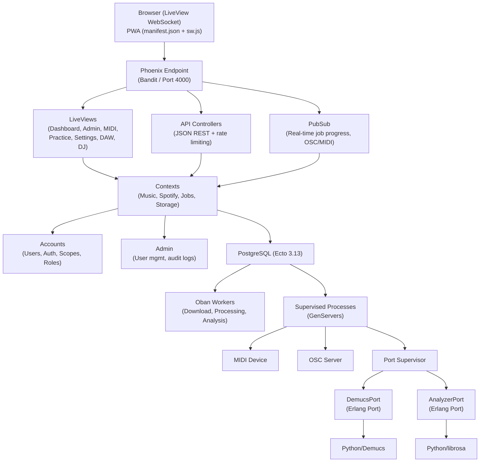
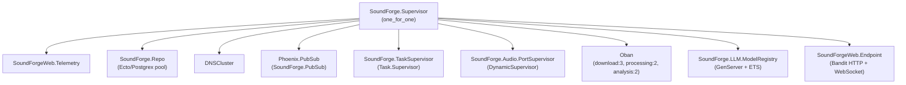

[Home](../index.md) > Architecture

# Architecture Overview

## Table of Contents

- [System Design Philosophy](#system-design-philosophy)
- [High-Level Diagram](#high-level-diagram)
- [OTP Supervision Tree](#otp-supervision-tree)
- [Component Summary](#component-summary)
- [Data Flow Summary](#data-flow-summary)

---

## System Design Philosophy

Sound Forge Alchemy is a single OTP release built on the BEAM virtual machine. The original Node.js/TypeScript predecessor required Redis for job queuing, Socket.IO for real-time updates, and a React build pipeline. The Elixir rewrite collapses all of that into one deployment artifact:

- **Phoenix LiveView** eliminates a separate frontend framework — the dashboard updates in real-time over a single WebSocket with server-rendered HTML diffs.
- **Oban + PostgreSQL** replaces Redis + BullMQ — jobs are inserted transactionally with their domain records; no orphaned jobs.
- **Erlang Ports** run Demucs and librosa in isolated OS processes — a crashing Python process cannot bring down the BEAM VM.
- **PubSub** is built into Phoenix — no external pub/sub broker needed.

---

## High-Level Diagram

---

## OTP Supervision Tree

| Child | Type | Purpose |
|-------|------|---------|
| `SoundForgeWeb.Telemetry` | Supervisor | Telemetry metrics and poller |
| `SoundForge.Repo` | GenServer | Ecto/PostgreSQL connection pool |
| `DNSCluster` | GenServer | Distributed Erlang clustering |
| `Phoenix.PubSub` | Supervisor | PubSub for real-time broadcasts |
| `SoundForge.TaskSupervisor` | Task.Supervisor | Async LiveView operations |
| `SoundForge.Audio.PortSupervisor` | DynamicSupervisor | Erlang Port lifecycle management |
| `Oban` | Supervisor | Background job processing |
| `SoundForge.LLM.ModelRegistry` | GenServer | LLM model capabilities (ETS) |
| `SoundForgeWeb.Endpoint` | Supervisor | HTTP + WebSocket serving |

---

## Component Summary

| Component | Module | Role |
|-----------|--------|------|
| Dashboard | `SoundForgeWeb.DashboardLive` | Primary user interface |
| API Controllers | `SoundForgeWeb.API.*` | JSON REST API |
| Job Channel | `SoundForgeWeb.JobChannel` | WebSocket job progress |
| Music Context | `SoundForge.Music` | Track/job CRUD |
| Spotify Context | `SoundForge.Spotify` | API client + OAuth |
| Jobs Contexts | `SoundForge.Jobs.*` | Oban worker orchestration |
| Storage | `SoundForge.Storage` | Local filesystem ops |
| DemucsPort | `SoundForge.Audio.DemucsPort` | Python stem separation |
| AnalyzerPort | `SoundForge.Audio.AnalyzerPort` | Python audio analysis |
| Agents | `SoundForge.Agents.*` | LLM-backed music intelligence |
| LLM Providers | `SoundForge.LLM.*` | Multi-provider LLM client |

---

## Data Flow Summary

1. User pastes Spotify URL → DashboardLive fetches metadata via `SoundForge.Spotify`
2. Track created in PostgreSQL via `SoundForge.Music`
3. Download job enqueued to Oban `download` queue (concurrency: 3)
4. `DownloadWorker` runs `spotdl`, updates job status, broadcasts via PubSub
5. Processing job enqueued to Oban `processing` queue (concurrency: 2)
6. `ProcessingWorker` calls `Audio.DemucsPort` → Erlang Port → Python Demucs
7. Analysis job enqueued to `analysis` queue (concurrency: 2)
8. `AnalysisWorker` calls `Audio.AnalyzerPort` → Erlang Port → Python librosa
9. All updates broadcast via `Phoenix.PubSub` → DashboardLive re-renders in real-time

---

## Detailed Pages

- [Stack Details](stack.md)
- [Agent System](agents.md)
- [LLM Providers](llm-providers.md)
- [Database Schema](database.md)

---

## See Also

- [Features Overview](../features/index.md)
- [API Reference](../api/index.md)
- [Deployment Guide](../guides/deployment.md)

---

[Next: Stack Details →](stack.md)
