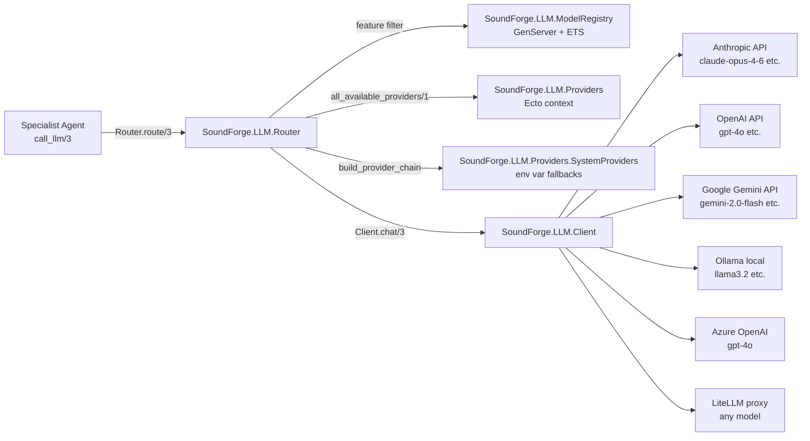

[Home](../index.md) > [Architecture](index.md) > LLM Providers

# LLM Providers

## Table of Contents

- [Overview](#overview)
- [Architecture Diagram](#architecture-diagram)
- [Supported Providers](#supported-providers)
- [Model Registry](#model-registry)
- [Provider Configuration](#provider-configuration)
- [Router](#router)
- [Model Selection Logic](#model-selection-logic)
- [Health Checks](#health-checks)
- [System vs User Providers](#system-vs-user-providers)
- [Adapter Modules](#adapter-modules)

---

## Overview

Sound Forge Alchemy uses a pluggable LLM adapter architecture. Users can configure their own API keys for any supported provider via the settings UI, or the system can fall back to server-level environment variable credentials.

All provider records are stored in PostgreSQL, encrypted at rest using `Cloak.Ecto` (AES-256-GCM). The `ModelRegistry` GenServer seeds known model capabilities into ETS on startup and runs 5-minute health checks.

---

## Architecture Diagram



---

## Supported Providers

| Provider | Type Atom | Category | Models |
|---------|-----------|----------|--------|
| Anthropic | `:anthropic` | cloud | claude-opus-4-6, claude-sonnet-4-20250514, claude-haiku-4-5-20251001 |
| OpenAI | `:openai` | cloud | gpt-4o, gpt-4o-mini, o3 |
| Google Gemini | `:google_gemini` | cloud | gemini-2.0-flash, gemini-2.5-pro |
| Azure OpenAI | `:azure_openai` | cloud | gpt-4o |
| Ollama | `:ollama` | local | llama3.2, mistral, codellama |
| LM Studio | `:lm_studio` | local | any locally loaded model |
| LiteLLM | `:litellm` | proxy | any model behind LiteLLM |
| Custom OpenAI | `:custom_openai` | proxy | any OpenAI-compatible endpoint |

**Cloud providers** require an `api_key` field.
**Local/proxy providers** require a `base_url` field.

LiteLLM is prioritized in the fallback chain when configured, as it can proxy to many underlying providers.

---

## Model Registry

**Module:** `SoundForge.LLM.ModelRegistry`

**File:** `lib/sound_forge/llm/model_registry.ex`

A `GenServer`-backed registry with ETS storage. The ETS table `:llm_model_registry` uses `{provider_type, model_name}` as the key and stores a capability map per model.

The registry:
1. Seeds known model capabilities on `init/1` via `seed_known_models/0`
2. Schedules a health check every 5 minutes (`@health_check_interval`)
3. Responds to `cast {:check_health, user_id}` for on-demand user-provider checks

### Model Capability Schema

```elixir
%{
  provider_type: :anthropic,
  model: "claude-opus-4-6",
  speed: :slow,           # :fast | :medium | :slow
  quality: :high,         # :high | :medium | :low
  cost: :high,            # :free | :low | :medium | :high
  context_window: 200_000,
  features: [:chat, :vision, :tool_use, :json_mode]
}
```

### Full Model List

| Provider | Model | Speed | Quality | Cost | Context | Features |
|---------|-------|-------|---------|------|---------|---------|
| Anthropic | claude-opus-4-6 | slow | high | high | 200k | chat, vision, tool_use, json_mode |
| Anthropic | claude-sonnet-4-20250514 | medium | high | medium | 200k | chat, vision, tool_use, json_mode |
| Anthropic | claude-haiku-4-5-20251001 | fast | medium | low | 200k | chat, vision, tool_use, json_mode |
| OpenAI | gpt-4o | medium | high | medium | 128k | chat, vision, tool_use, json_mode, audio |
| OpenAI | gpt-4o-mini | fast | medium | low | 128k | chat, vision, tool_use, json_mode |
| OpenAI | o3 | slow | high | high | 128k | chat, tool_use, json_mode |
| Google Gemini | gemini-2.0-flash | fast | medium | low | 1M | chat, vision, tool_use, json_mode, audio |
| Google Gemini | gemini-2.5-pro | medium | high | medium | 1M | chat, vision, tool_use, json_mode, audio |
| Ollama | llama3.2 | medium | medium | free | 128k | chat, tool_use |
| Ollama | mistral | fast | medium | free | 32k | chat |
| Ollama | codellama | medium | medium | free | 16k | chat |
| Azure OpenAI | gpt-4o | medium | high | medium | 128k | chat, vision, tool_use, json_mode |

### Public API

```elixir
# List all known models
ModelRegistry.list_models()

# Get models supporting specific features
ModelRegistry.models_for_task([:chat, :vision])

# Find best model for a task
ModelRegistry.best_model_for(:analysis, prefer: :speed)
ModelRegistry.best_model_for(:chat, prefer: :quality, provider_types: [:anthropic])

# Get specific model capabilities
ModelRegistry.get_model(:anthropic, "claude-opus-4-6")

# Trigger health check for a user's providers
ModelRegistry.check_health(user_id)
```

### Selection Preferences

| Preference | Strategy | Implementation |
|-----------|---------|----------------|
| `:quality` (default) | Maximize quality score | `Enum.max_by(quality_score/1)` — high=3, medium=2, low=1 |
| `:speed` | Minimize latency | `Enum.min_by(speed_score/1)` — fast=0, medium=1, slow=2 |
| `:cost` | Minimize cost | `Enum.min_by(cost_score/1)` — free=0, low=1, medium=2, high=3 |

---

## Provider Configuration

**Module:** `SoundForge.LLM.Provider` (Ecto schema)

**File:** `lib/sound_forge/llm/provider.ex`

**Context:** `SoundForge.LLM.Providers`

**File:** `lib/sound_forge/llm/providers.ex`

Providers are stored as database records per user. The unique constraint is `(user_id, provider_type, name)`.

| Field | Type | Description |
|-------|------|-------------|
| `id` | `binary_id` | UUID primary key |
| `user_id` | `integer` | Owning user (FK → users) |
| `provider_type` | enum | Provider type atom |
| `name` | string | User-defined display name |
| `api_key` | encrypted binary | Encrypted at rest via Cloak.Ecto AES-256-GCM |
| `base_url` | string | Base URL for local/proxy providers |
| `default_model` | string | Default model identifier |
| `enabled` | boolean | Whether provider is active (default: true) |
| `priority` | integer | Preference order (lower = higher priority) |
| `health_status` | enum | `:healthy`, `:degraded`, `:unreachable`, `:unknown` |
| `last_health_check_at` | utc_datetime | Timestamp of last health check |
| `config_json` | map | Provider-specific extra configuration |

### Context Operations

```elixir
# List all providers for a user (ordered by priority ASC)
Providers.list_providers(user_id)

# Get only enabled providers (ordered by priority ASC)
Providers.get_enabled_providers(user_id)

# Create a new provider (priority auto-assigned if not specified)
Providers.create_provider(user_id, %{
  provider_type: :anthropic,
  name: "My Claude",
  api_key: "sk-ant-..."
})

# Create an Ollama provider
Providers.create_provider(user_id, %{
  provider_type: :ollama,
  name: "Local Ollama",
  base_url: "http://localhost:11434"
})

# Toggle enabled state
Providers.toggle_provider(provider)         # flip current value
Providers.toggle_provider(provider, true)   # explicit set

# Bulk reorder (runs in a single transaction)
Providers.reorder_providers(user_id, [{id1, 0}, {id2, 1}, {id3, 2}])

# Update health status
Providers.update_health(provider, :healthy)   # or :unreachable

# Get all available: DB records + system env fallbacks
Providers.all_available_providers(user_id)
```

---

## Router

**Module:** `SoundForge.LLM.Router`

**File:** `lib/sound_forge/llm/router.ex`

The Router selects the best available provider for a given task and attempts fallbacks if the primary fails.

### `route/3`

```elixir
Router.route(user_id, messages, task_spec) :: {:ok, Response.t()} | {:error, term()}
```

Returns `{:error, :no_providers_available}` if no providers are configured for the user.
Returns `{:error, {:all_providers_failed, errors}}` if all fallback attempts are exhausted.

### `task_spec` type

```elixir
%{
  optional(:task_type) => atom(),         # :chat | :analysis | :vision | :tool_use
  optional(:prefer) => :speed | :quality | :cost,
  optional(:features) => [atom()],        # required feature flags
  optional(:model) => String.t(),         # override model name
  optional(:provider_type) => atom(),     # force a specific provider type
  optional(:system) => String.t(),        # override system message
  optional(:max_tokens) => integer(),
  optional(:temperature) => float()
}
```

### Provider Chain Building

1. If `task_spec.provider_type` set, that provider type goes first
2. LiteLLM providers are always next in the chain
3. Remaining providers sorted by `priority + health_penalty` (unreachable adds 1000)
4. If `task_spec.features` set, providers whose `default_model` lacks those features are excluded
5. Chain is capped at `@max_fallback_attempts` (4)

---

## Model Selection Logic

The `ModelRegistry.best_model_for/2` function:

1. Collect all models matching required features via `models_for_task/1`
2. If `provider_types` option supplied, filter to those provider types
3. Apply preference scoring (`:quality`, `:speed`, or `:cost`)
4. Return the best candidate, or `nil` if no models match

Task-to-feature mapping used internally:

| Task | Required Features |
|------|------------------|
| `:chat` | `[:chat]` |
| `:analysis` | `[:chat, :json_mode]` |
| `:vision` | `[:chat, :vision]` |
| `:tool_use` | `[:chat, :tool_use]` |

---

## Health Checks

The `ModelRegistry` schedules health checks every 5 minutes (`@health_check_interval = :timer.minutes(5)`):

1. **System providers** — loaded from environment variables, ping-checked on schedule, status only logged (not persisted, as they have no DB row)
2. **User providers** — checked on demand via `ModelRegistry.check_health(user_id)`, status persisted to the `llm_providers` table

Health checks are run in supervised `Task.start/1` processes so failures don't crash the GenServer.

Health check implementation: `SoundForge.LLM.Client.test_connection/1` sends a minimal ping request to the provider's API endpoint.

On a successful `Client.chat/3` call, the Router immediately calls `Providers.update_health(provider, :healthy)`. On failure, it calls `Providers.update_health(provider, :unreachable)`.

---

## System vs User Providers

**Module:** `SoundForge.LLM.Providers.SystemProviders`

**File:** `lib/sound_forge/llm/providers/system_providers.ex`

System providers are read from environment variables and returned as virtual (non-persisted) `Provider` structs with `id: nil`. They act as fallbacks when a user has not configured their own provider of a given type.

### Environment Variables

| Variable | Provider Type | Field |
|----------|--------------|-------|
| `ANTHROPIC_API_KEY` | `:anthropic` | api_key |
| `OPENAI_API_KEY` | `:openai` | api_key |
| `OPENAI_BASE_URL` | `:openai` | base_url (optional) |
| `AZURE_OPENAI_API_KEY` | `:azure_openai` | api_key |
| `AZURE_OPENAI_ENDPOINT` | `:azure_openai` | base_url |
| `GOOGLE_AI_API_KEY` | `:google_gemini` | api_key |
| `OLLAMA_BASE_URL` | `:ollama` | base_url (default: `http://localhost:11434`) |
| `LITELLM_BASE_URL` | `:litellm` | base_url |
| `LITELLM_API_KEY` | `:litellm` | api_key (optional) |

System providers are assigned priority starting at 1000 (so they sort after all user-configured providers).

### Precedence Rules

When `Providers.all_available_providers/1` is called:
1. All DB-persisted providers for the user are returned first (ordered by their `priority`)
2. System env providers whose `provider_type` is NOT already covered by the user's DB records are appended
3. User DB providers always take precedence — if a user has configured Anthropic, the `ANTHROPIC_API_KEY` system fallback is excluded

```elixir
# Example: user has :anthropic configured in DB, system has OPENAI_API_KEY
Providers.all_available_providers(user_id)
# => [%Provider{provider_type: :anthropic, ...},   # user's DB record
#     %Provider{id: nil, provider_type: :openai, ...}]  # system fallback
```

---

## Adapter Modules

Provider-specific HTTP adapters live in `lib/sound_forge/llm/adapters/`:

| File | Provider |
|------|---------|
| `anthropic.ex` | Anthropic Messages API |
| `openai.ex` | OpenAI Chat Completions API |
| `azure_openai.ex` | Azure OpenAI REST API |
| `google_gemini.ex` | Google Gemini generateContent API |
| `ollama.ex` | Ollama `/api/chat` endpoint |
| `lm_studio.ex` | LM Studio (OpenAI-compatible) |
| `litellm.ex` | LiteLLM proxy (OpenAI-compatible) |
| `openai_compatible.ex` | Generic OpenAI-compatible base |
| `custom_openai.ex` | Custom OpenAI-compatible endpoint |

All adapters receive a `%Provider{}` struct and messages list, and return `{:ok, %Response{}}` or `{:error, reason}`. HTTP calls use `Req` (`~> 0.5`).

**Response module:** `SoundForge.LLM.Response` — normalized response with `content`, `model`, `usage` (input/output token counts).

---

## See Also

- [Agent System](agents.md)
- [Configuration Guide](../guides/configuration.md)
- [AI Agents Feature](../features/ai-agents.md)

---

[← Agent System](agents.md) | [Next: Database Schema →](database.md)
