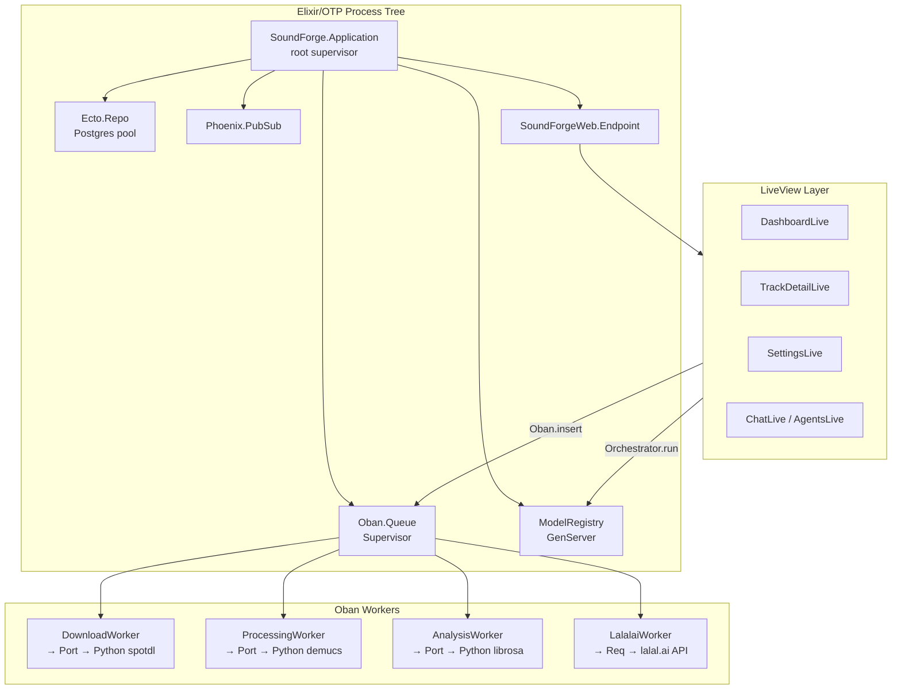

[Home](../index.md) > [Architecture](index.md) > Tech Stack

# Tech Stack

## Table of Contents

- [Backend (Elixir/OTP)](#backend-elixirotp)
- [Frontend (Phoenix Templates)](#frontend-phoenix-templates)
- [Audio Processing (Python)](#audio-processing-python)
- [Database](#database)
- [Background Jobs](#background-jobs)
- [Infrastructure](#infrastructure)
- [Full Dependency List](#full-dependency-list)
- [Architecture Rationale](#architecture-rationale)

---

## Backend (Elixir/OTP)

| Technology | Version | Purpose |
|-----------|---------|---------|
| Elixir | `~> 1.15` | Application language |
| OTP (Erlang/BEAM) | 26+ | Concurrency, fault tolerance, supervision trees |
| Phoenix | `~> 1.8.3` | Web framework |
| Phoenix LiveView | `~> 1.1.0` | Real-time UI without JavaScript SPA |
| Bandit | `~> 1.5` | HTTP server (replaces Cowboy) |
| Ecto | `~> 3.13` | Database ORM and migrations |
| Oban | `~> 2.18` | Background job processing |
| Req | `~> 0.5` | HTTP client (Spotify API, lalal.ai, LLM providers) |
| Cloak.Ecto | `~> 1.3` | At-rest encryption (API keys, OAuth tokens) |
| Midiex | `~> 0.6` | MIDI device interface |
| Swoosh | `~> 1.16` | Transactional email |
| Gettext | `~> 1.0` | Internationalization |
| Jason | `~> 1.2` | JSON encoding/decoding |
| dns_cluster | `~> 0.2.0` | Distributed Erlang node clustering |
| bcrypt_elixir | `~> 3.0` | Password hashing |

### Application Version

`mix.exs` reports `version: "4.1.0"` (internal tracking; releases are tagged separately — see CHANGELOG.md for v4.4.0).

### Why Phoenix 1.8

Phoenix 1.8 introduces colocated JS hooks (`:type={Phoenix.LiveView.ColocatedHook}`), a new Tailwind v4 CSS pipeline, and improved `phx.gen.auth` with scope-based authentication. SFA uses all three.

### Why Oban (Not Redis + BullMQ)

The TypeScript predecessor used BullMQ on Redis. Oban provides equivalent functionality using the existing PostgreSQL database:
- Jobs inserted in the same transaction as their domain records — no orphans
- LISTEN/NOTIFY for real-time dispatch (no polling)
- Configurable per-queue concurrency: `download: 3, processing: 2, analysis: 2`
- Built-in retry with configurable `max_attempts`

### Why Erlang Ports (Not NIFs)

Demucs (PyTorch) and librosa (NumPy/SciPy) are mature Python libraries with no Elixir equivalents. Ports run them as supervised OS processes:
- A Python crash cannot take down the BEAM VM
- Long-running operations (seconds to minutes) — unsuitable as NIFs
- No HTTP overhead — communication over OS pipes (stdin/stdout) using newline-delimited JSON

---

## Frontend (Phoenix Templates)

| Technology | Version | Purpose |
|-----------|---------|---------|
| Phoenix HEEx | 1.8 | Server-rendered HTML templates |
| Tailwind CSS | v4 | Utility-first CSS (no tailwind.config.js in v4) |
| daisyUI | 4.x | Component library base |
| esbuild | `~> 0.10` | JavaScript bundling |
| D3.js | 7.x | Audio analysis visualizations |
| Heroicons | v2.2.0 | SVG icon system (GitHub sparse checkout) |

### D3.js Hooks

Five Phoenix JS hooks render audio analysis data as interactive SVG charts. Registered in `assets/js/app.js`:

| Hook Name | Visualization | Data Source |
|-----------|--------------|-------------|
| `AnalysisRadar` | Spider/radar chart of feature scores | `analysis_results.features` |
| `AnalysisChroma` | 12-bin chromagram (pitch class energy) | `analysis_results.features.chroma` |
| `AnalysisBeats` | Beat grid timeline | `analysis_results.features.beats` |
| `AnalysisMFCC` | MFCC coefficient heatmap | `analysis_results.features.mfcc` |
| `AnalysisSpectral` | Spectral centroid + rolloff line chart | `analysis_results.spectral_centroid/rolloff` |

---

## Audio Processing (Python)

**Python version:** 3.11.7 (pinned in `.tool-versions`)

Python scripts live in `priv/python/`:

| Script | Purpose |
|--------|---------|
| `analyzer.py` | Audio feature extraction via librosa |
| `demucs_runner.py` | Local stem separation via Demucs |
| `spotify_dl.py` | Audio download via spotdl |
| `batch_cover_art.py` | Batch album art fetching |

### Python Libraries

| Library | Purpose |
|---------|---------|
| Demucs | Local stem separation (PyTorch-based neural network) |
| librosa | Audio feature extraction (tempo, key, energy, MFCC, chroma, spectral) |
| spotdl | Spotify audio download (YouTube source + Spotify metadata) |
| lalal.ai API | Cloud stem separation via HTTP REST API (no local Python required) |

### Demucs Models

| Model | Stems | Quality | Speed |
|-------|-------|---------|-------|
| `htdemucs` | 4 (vocals, drums, bass, other) | Good | Fast |
| `htdemucs_ft` | 4 (vocals, drums, bass, other) | High | Slow |
| `htdemucs_6s` | 6 (+ guitar, piano) | Good | Medium |
| `mdx_extra` | 4 (vocals-optimized) | High for vocals | Medium |

### lalal.ai Stem Types

lalal.ai provides more stem types than Demucs: vocals, drums, bass, electric guitar, acoustic guitar, piano, synth, strings, wind. It also supports 60-second preview separation without a full download (controlled by `processing_jobs.preview = true`).

### Python/Erlang Port Protocol

Communication uses newline-delimited JSON over stdin/stdout:

```json
// Progress update (demucs_runner.py / analyzer.py)
{"type": "progress", "percent": 45}

// Demucs result
{"type": "result", "stems": {"vocals": "stems/track_id/vocals.wav", "drums": "stems/track_id/drums.wav"}}

// Analyzer result (analyzer.py)
{"tempo": 120.5, "key": "C major", "energy": 0.74, "spectral_centroid": 1823.4,
 "spectral_rolloff": 4210.2, "zero_crossing_rate": 0.08,
 "features": {"mfcc": [...], "chroma": [...], "beats": [...]}}

// Error
{"type": "error", "message": "File not found"}
```

---

## Database

| Technology | Version | Purpose |
|-----------|---------|---------|
| PostgreSQL | 14+ | Primary data store |
| Ecto SQL | `~> 3.13` | ORM and migrations |
| Postgrex | `>= 0.0.0` | PostgreSQL driver |
| Oban | `~> 2.18` | Job queue tables (`oban_jobs`) |

All primary keys are `binary_id` (UUID v4) except `users` (integer) and Oban system tables (bigserial). See [Database Schema](database.md) for full schema.

---

## Background Jobs

Oban queues and workers:

| Queue | Concurrency | Primary Worker | Purpose |
|-------|-------------|---------------|---------|
| `download` | 3 | `DownloadWorker` | spotdl audio downloads |
| `processing` | 2 | `ProcessingWorker` | Demucs stem separation |
| `analysis` | 2 | `AnalysisWorker` | librosa feature extraction |

Additional workers:

| Worker | Purpose |
|--------|---------|
| `LalalaiWorker` | Cloud stem separation via lalal.ai API |
| `AutoCueWorker` | Automated cue point generation |
| `ChefWorker` | Batch orchestration |
| `CleanupWorker` | Expired file removal |
| `MultistemWorker` | Multi-stem batch processing |
| `ProviderHealthWorker` | LLM provider health checks |
| `VoiceChangeWorker` | Voice transformation processing |
| `VoiceCleanWorker` | Voice cleaning / de-noise processing |

---

## Infrastructure

| Service | Purpose |
|---------|---------|
| Azure Container Apps | Production hosting |
| Azure Container Registry | Docker image storage |
| Azure PostgreSQL Flexible Server | Managed PostgreSQL database |
| Docker (multi-stage) | Build and deployment packaging |
| GitHub Actions | CI/CD pipeline |

### Docker Build Notes

- BEAM VM cannot run under QEMU on Apple Silicon — always use `az acr build` for remote amd64 builds
- ACR build does not support ARG interpolation in `FROM` directives — hardcode image references
- Final image is ~4.8GB due to Python deps (Demucs/PyTorch, librosa, spotdl)
- Use `mix release` for production; `Release.migrate/0` runs migrations before app start

---

## Full Dependency List

From `mix.exs` (as of the current codebase):

```elixir
defp deps do
  [
    # Auth
    {:bcrypt_elixir, "~> 3.0"},

    # Phoenix web framework
    {:phoenix, "~> 1.8.3"},
    {:phoenix_ecto, "~> 4.5"},
    {:ecto_sql, "~> 3.13"},
    {:postgrex, ">= 0.0.0"},
    {:phoenix_html, "~> 4.1"},
    {:phoenix_live_reload, "~> 1.2", only: :dev},
    {:phoenix_live_view, "~> 1.1.0"},
    {:lazy_html, ">= 0.1.0", only: :test},
    {:phoenix_live_dashboard, "~> 0.8.3"},

    # Frontend asset pipeline
    {:esbuild, "~> 0.10", runtime: Mix.env() == :dev},
    {:tailwind, "~> 0.3", runtime: Mix.env() == :dev},
    {:heroicons,
     github: "tailwindlabs/heroicons",
     tag: "v2.2.0",
     sparse: "optimized",
     app: false,
     compile: false,
     depth: 1},

    # Utilities
    {:swoosh, "~> 1.16"},           # Email
    {:req, "~> 0.5"},               # HTTP client
    {:telemetry_metrics, "~> 1.0"},
    {:telemetry_poller, "~> 1.0"},
    {:gettext, "~> 1.0"},           # i18n
    {:jason, "~> 1.2"},             # JSON
    {:dns_cluster, "~> 0.2.0"},     # Distributed Erlang
    {:bandit, "~> 1.5"},            # HTTP server

    # Background jobs
    {:oban, "~> 2.18"},

    # Testing
    {:mox, "~> 1.0", only: :test},

    # MIDI
    {:midiex, "~> 0.6"},

    # Encryption
    {:cloak_ecto, "~> 1.3"},

    # Static analysis (dev/test only)
    {:credo, "~> 1.7", only: [:dev, :test], runtime: false},
    {:dialyxir, "~> 1.4", only: [:dev, :test], runtime: false}
  ]
end
```

### Mix Aliases

| Alias | Commands |
|-------|---------|
| `mix setup` | `deps.get`, `ecto.setup`, `assets.setup`, `assets.build` |
| `mix ecto.setup` | `ecto.create`, `ecto.migrate`, `run priv/repo/seeds.exs` |
| `mix ecto.reset` | `ecto.drop`, `ecto.setup` |
| `mix test` | `ecto.create --quiet`, `ecto.migrate --quiet`, `test` |
| `mix assets.setup` | Install Tailwind + esbuild if missing |
| `mix assets.build` | Compile Tailwind + esbuild bundles |
| `mix assets.deploy` | Minified production bundles + `phx.digest` |
| `mix precommit` | `compile --warnings-as-errors`, `deps.unlock --unused`, `format`, `test` |

---

## Architecture Rationale



The BEAM supervision tree ensures that a crash in any worker does not bring down the HTTP endpoint or other running jobs. Oban workers are restarted automatically up to `max_attempts` times.

---

## See Also

- [Architecture Overview](index.md)
- [Agent System](agents.md)
- [LLM Providers](llm-providers.md)
- [Installation Guide](../guides/installation.md)

---

[← Architecture Overview](index.md) | [Next: Agent System →](agents.md)
