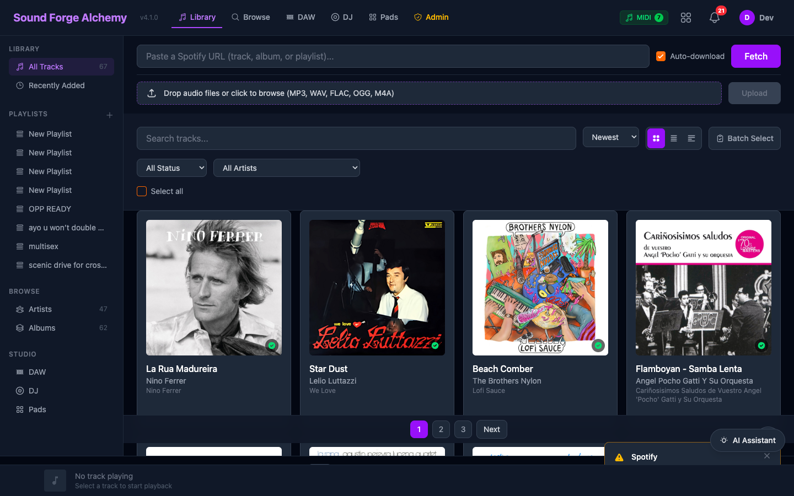

[Home](../index.md) > [Features](index.md) > DJ / DAW Tools

# DJ / DAW Tools

Two-deck DJ mixer and multi-track DAW editor.

## Table of Contents

- [Overview](#overview)
- [DJ Deck](#dj-deck)
- [Instantaneous Playback Architecture](#instantaneous-playback-architecture)
- [AI Cue Detection](#ai-cue-detection)
- [Stem Loop Decks](#stem-loop-decks)
- [Crossfader and Curve Modes](#crossfader-and-curve-modes)
- [Transport and Sync](#transport-and-sync)
- [Chef AI Set Builder](#chef-ai-set-builder)
- [Virtual Controller](#virtual-controller)
- [Chromatic Pads](#chromatic-pads)
- [DAW Editor](#daw-editor)
- [LiveComponent Architecture](#livecomponent-architecture)
- [JS Hooks](#js-hooks)
- [MIDI/OSC Control](#midiosc-control)
- [Export](#export)

---

## Overview

SFA includes two professional audio tools built into the dashboard:

- **DJ Deck** — A two-deck mixer for live mixing with BPM sync, loop controls, EQ, and cue points.
- **DAW Editor** — A multi-track editor for per-stem mute/solo, volume control, and MIDI export.

Both are accessed via tabs on the main dashboard at `/` (using `?tab=dj` and `?tab=daw`). Legacy routes `/dj` and `/daw/:track_id` redirect to the appropriate dashboard tabs.


*The main dashboard at `/`. The **DAW**, **DJ**, and **Pads** tabs in the top navigation open the respective tools. The left sidebar's **Studio** section (DAW, DJ, Pads) provides the same navigation. Both tools are LiveComponents embedded in `DashboardLive` and share its track library without a separate data fetch.*

---

## DJ Deck

**LiveComponent:** `SoundForgeWeb.DjLive`
**JS Hook:** `DjDeck`

### Features

- **Two decks (A and B)** — Each loads a downloaded track with full playback controls
- **BPM sync** — Pitch-shift one deck to match the other's tempo
- **Loop controls** — Set loop start/end points; toggle active loop
- **EQ (3-band)** — High, mid, low frequency adjusters per deck
- **Crossfader** — Blend between decks
- **Cue points** — Set and jump to named cue markers
- **Waveform display** — Scrolling waveform with playhead and beat grid

### Keyboard Shortcuts

| Key | Action |
|-----|--------|
| `Space` | Play/pause active deck |
| `1` / `2` | Switch active deck |
| `Q` | Set cue on active deck |
| `W` | Jump to cue on active deck |
| `A` / `S` | Adjust crossfader left/right |

### Deck Session Persistence

Active deck sessions are stored in `SoundForge.DJ.DeckSession` (ETS-backed). Sessions persist for the browser session duration.

---

## Instantaneous Playback Architecture

DJ playback uses a `JS.dispatch` + `JS.push` dual-path architecture for sub-frame response times. User interactions (play, pause, cue trigger) execute immediately in the browser via `JS.dispatch` while simultaneously pushing events to the server via `JS.push`. This eliminates the WebSocket round-trip from the critical playback path.

### JS.dispatch + JS.push Pattern

```elixir
# In the HEEx template — both fire on the same click
<button
  phx-click={
    JS.dispatch("dj:play", to: "#deck-a")
    |> JS.push("toggle_play", value: %{deck: "a"})
  }
>
  Play
</button>
```

**Why two paths?**

- `JS.dispatch("dj:play")` fires a DOM CustomEvent caught by the DjDeck hook immediately. The Web Audio API starts playback on the same animation frame -- no network latency.
- `JS.push("toggle_play")` sends the event to the server so the LiveView can update its state, persist the deck session, and broadcast to other connected clients.

The server-side handler updates assigns but does not re-push playback commands back to the originating client. This avoids double-triggering.

### Dual-Deck Simultaneous Playback

Both decks run independent Web Audio API `AudioContext` graphs. Each deck maintains its own:

- `AudioBufferSourceNode` (loaded track)
- `GainNode` chain (volume, EQ bands)
- `BiquadFilterNode` trio (high/mid/low EQ)
- Playback position tracker (requestAnimationFrame loop)

Crossfader blending is applied at the gain stage, not by re-routing audio nodes. This allows both decks to play simultaneously with zero glitching during transitions.

### Bug Fixes (v4.5.x)

- **ArgumentError in toggle_play/set_hot_cue/trigger_cue**: Fixed `to_string` type coercion -- deck identifiers were arriving as atoms in some code paths but strings in others. Normalized to string at the handler boundary.
- **30Hz WebSocket flood**: The `debug_log` handler was firing on every LiveView event, flooding the WebSocket at ~30Hz during playback. Added a guard clause (`if @debug_panel_open`) so debug messages are only pushed when the debug panel is visible.
- **BPM throttle**: `handle_event("update_bpm")` now rate-limits to one server update per 5 seconds. Intermediate BPM slider values are applied locally via JS.dispatch without round-tripping.

---

## AI Cue Detection

The DJ system includes an AI-powered cue detection engine that analyzes track structure and automatically places cue points at musically significant positions.

### Capabilities

- **26+ cues per track** -- covers intros, drops, breakdowns, chorus entries, bridges, outros, and beat-grid-aligned transition points
- Cue detection runs as an Oban job (`AutoCueWorker`) triggered after analysis completes
- Results stored in `cue_points` table with `position_ms`, `label`, `color`, and `source` (`:auto` vs `:manual`)
- Auto-cues integrate with the chromatic pads -- each pad can be assigned an auto-detected cue

### Usage

Auto-cues appear as colored markers on the deck waveform. Users can promote, rename, delete, or re-color any auto-cue. Manual cues set by the user always take priority over auto-detected ones at the same position.

---

## Stem Loop Decks

Each DJ deck can load individual stems (vocals, drums, bass, other) into dedicated sub-decks called **stem loop decks**. This enables per-stem loop control during a live mix.

- Each stem loop deck has independent loop start/end points and toggle
- Stems are sourced from a completed separation job for the loaded track
- Stem volumes can be adjusted independently while the main deck plays
- Useful for isolating a vocal loop over a different track's instrumental

---

## Crossfader and Curve Modes

The crossfader supports multiple blend curves to match different mixing styles:

| Curve | Behavior |
|-------|----------|
| Linear | Equal-power linear blend (default) |
| Constant Power | Logarithmic curve, no volume dip at center |
| Sharp Cut | Near-instant cut at the midpoint -- scratch/battle style |
| Slow Fade | Extended center range for long transitions |

Curve selection is per-session and stored in the deck session ETS entry.

---

## Transport and Sync

### SMPTE / Bar-Beat Display

The transport bar shows both SMPTE timecode (`HH:MM:SS:FF`) and musical position (`Bar.Beat.Tick`) derived from the track's detected BPM and time signature. The bar-beat display updates at 60fps via `requestAnimationFrame`.

### Master Sync

When master sync is enabled, Deck B pitch-locks to Deck A's tempo. BPM adjustments on Deck A propagate to Deck B in real time. The sync engine uses phase-aligned stretching (Web Audio API `playbackRate`) rather than re-pitching, preserving the original key.

### Metronome

A built-in click track synchronized to the master BPM. Routed to a separate `AudioContext` destination (headphone cue) when supported by the audio hardware.

---

## Chef AI Set Builder

Chef is an AI-powered set builder that sequences tracks based on harmonic compatibility, energy arc, and genre coherence. It analyzes the user's library and suggests a playlist order optimized for DJ transitions.

- Uses analysis data (BPM, key, energy, valence) to compute transition scores
- Supports manual re-ordering with live score recalculation
- Export as ordered playlist or direct-load into DJ decks

---

## Virtual Controller

A software MIDI controller rendered in the browser for users without physical hardware. Provides:

- Play/pause/cue buttons per deck
- Crossfader slider
- EQ knobs (hi/mid/lo)
- Volume faders
- Loop in/out controls

The virtual controller dispatches the same events as physical MIDI-mapped controllers, using the same `JS.dispatch` path.

---

## Chromatic Pads

A grid of trigger pads (styled after MPC/Maschine layouts) that fire cue points and one-shot samples. Pads auto-populate from AI cue detection results and can be manually reassigned.

- Each pad stores a `cue_point_id` or a sample file reference
- Velocity-sensitive when triggered via MIDI (velocity mapped to gain)
- Visual feedback: pads light up on trigger with color matching the assigned cue

### Preset Import

Pad layouts and controller mappings can be imported/exported as JSON preset files. Built-in presets ship for common controllers (Pioneer DDJ, Traktor Kontrol, Akai MPC).

---

## DAW Editor

**LiveComponent:** `SoundForgeWeb.DawLive`
**JS Hook:** `DawEditor`, `DawPreview`

### Features

- **Multi-track view** — One lane per stem (vocals, drums, bass, other/guitar/piano)
- **Per-stem controls:**
  - Mute toggle
  - Solo mode
  - Volume fader (0–200%)
  - Pan knob (-100 to +100)
- **Timeline** — Zoom in/out, scrub position
- **Edit operations** — Cut, copy, trim, fade in/out (stored as `SoundForge.DAW.EditOperation` records)
- **Preview** — Real-time stem mixing in the browser via Web Audio API
- **MIDI export** — Export beat grid and cue points as MIDI file

### Edit Operations

Edit operations are stored as a log in PostgreSQL, enabling undo/redo:

```elixir
# EditOperation schema
%EditOperation{
  track_id: uuid,
  operation: "cut" | "fade_in" | "fade_out" | "trim" | "volume",
  params: %{start_ms: 1000, end_ms: 5000, value: 0.8},
  applied_at: datetime
}
```

### DAW Export API

```
POST /api/daw/export
Content-Type: multipart/form-data
Authorization: session cookie

{stem files + edit manifest}
-> Returns processed audio file
```

---

## LiveComponent Architecture

Both DJ and DAW are `Phoenix.LiveComponent` embedded in `DashboardLive`. They are **not** standalone LiveViews.

```
DashboardLive (LiveView)
  |
  +-- DjLive (LiveComponent) [?tab=dj]
  |     |-- DjDeck JS Hook
  |
  +-- DawLive (LiveComponent) [?tab=daw]
        |-- DawEditor JS Hook
        |-- DawPreview JS Hook
```

PubSub messages from the server are forwarded from `DashboardLive` to the appropriate component via `send_update/3`.

### Why LiveComponents (not LiveViews)

- DashboardLive holds the track stream (the source of truth for the library)
- DJ and DAW need read access to that library without a separate data fetch
- LiveComponents can call `send_update` to receive targeted updates from the parent

---

## JS Hooks

### DjDeck Hook

```javascript
// assets/js/hooks/dj_deck.js
const DjDeck = {
  mounted() {
    // Initialize Web Audio API nodes (deck A and B)
    // Handle phx events: load_track, play, pause, set_bpm, set_loop
    this.handleEvent("deck_update", ({deck, state}) => {
      // Update waveform display, playhead, cue markers
    })
  }
}
```

### DawEditor Hook

```javascript
// assets/js/hooks/daw_editor.js
const DawEditor = {
  mounted() {
    // Initialize timeline canvas
    // Handle stem mute/solo/volume events
    this.handleEvent("stem_update", ({stems}) => {
      // Re-render track lanes
    })
  }
}
```

### DawPreview Hook

Handles real-time stem mixing using Web Audio API `GainNode` and `ChannelMergerNode`:

```javascript
const DawPreview = {
  mounted() {
    this.ctx = new AudioContext()
    this.stemNodes = {}  // One AudioBufferSourceNode per stem

    this.handleEvent("load_stems", ({stems}) => {
      // Fetch + decode each stem file
      // Route through individual GainNodes
    })

    this.handleEvent("update_volume", ({stem_type, volume}) => {
      this.stemNodes[stem_type].gainNode.gain.value = volume
    })
  }
}
```

---

## MIDI/OSC Control

**Module:** `SoundForge.MIDI` (midiex)
**Module:** `SoundForge.OSC`

Both DJ decks and DAW controls can be mapped to MIDI hardware controllers:

- **MIDI Learn** — Click a control and press a MIDI button/knob to assign
- **Preset mappings** — Built-in mappings for popular controllers (Pioneer DDJ-200, Traktor Kontrol S2)
- **OSC** — Open Sound Control server for DAW integration (Ableton Link, TouchOSC)

MIDI mappings are stored in `SoundForge.DJ.Presets` and persisted per user in the database.

---

## Export

| Export | Route | Format |
|--------|-------|--------|
| Single stem | `GET /export/stem/{id}` | WAV/MP3 |
| All stems (ZIP) | `GET /export/stems/{track_id}` | ZIP |
| Analysis JSON | `GET /export/analysis/{track_id}` | JSON |
| DAW export | `POST /api/daw/export` | Processed WAV |

---

## See Also

- [Stem Separation](stem-separation.md)
- [Audio Analysis](analysis.md)
- [API: DAW Export](../api/rest.md#daw)
- [WebSocket: Events](../api/websocket.md)

---

[← Audio Analysis](analysis.md) | [Next: AI Agents →](ai-agents.md)
