[Home](../index.md) > [Guides](index.md) > Development

# Development Guide

Dev setup, devtools, testing, and contributing workflow.

## Table of Contents

- [Dev Setup](#dev-setup)
- [Mix Aliases](#mix-aliases)
- [Dev Server Management](#dev-server-management)
- [Testing](#testing)
- [Code Quality](#code-quality)
- [Asset Pipeline](#asset-pipeline)
- [Phoenix LiveDashboard](#phoenix-livedashboard)
- [Debugging Tips](#debugging-tips)
- [Project Structure](#project-structure)

---

## Dev Setup

Follow the [Installation Guide](installation.md) to get all prerequisites. Then:

```bash
# Full setup in one command
mix setup
```

This runs: `deps.get`, `ecto.setup`, `assets.setup`, `assets.build`.

---

## Mix Aliases

| Alias | Command | Description |
|-------|---------|-------------|
| `mix setup` | `deps.get + ecto.setup + assets.setup + assets.build` | Full project setup |
| `mix ecto.setup` | `ecto.create + ecto.migrate + run seeds.exs` | Database setup |
| `mix ecto.reset` | `ecto.drop + ecto.setup` | Full DB reset |
| `mix assets.setup` | Install Tailwind and esbuild | Asset tooling setup |
| `mix assets.build` | Build assets for dev | Compile CSS + JS |
| `mix assets.deploy` | Minify + digest assets | Production build |
| `mix precommit` | `compile --warnings-as-errors + deps.unlock --unused + format + test` | Pre-commit checks |

### Running Tests

```bash
# Run all tests
mix test

# Run a specific file
mix test test/sound_forge/music_test.exs

# Run previously failed tests
mix test --failed

# Run with verbose output
mix test --trace
```

---

## Dev Server Management

```bash
# Start with hot reload
source .env && mix phx.server

# Start in IEx (interactive Elixir)
source .env && iex -S mix phx.server

# Check for running servers on standard ports
lsof -ti:4000,4001

# Kill existing server
kill $(lsof -ti:4000)
```

The `phoenix_live_reload` dependency watches for file changes and automatically reloads:
- Elixir source files (recompiles + reloads)
- HEEx templates (live reload)
- CSS/JS assets (browser reload)

---

## Testing

### Test Stack

| Layer | Tool |
|-------|------|
| Unit tests | ExUnit |
| LiveView tests | `Phoenix.LiveViewTest` |
| HTML assertions | `LazyHTML` |
| Mocks | `Mox` |
| Oban testing | `Oban.Testing` |

### Test Configuration

In `config/test.exs`:
- Oban runs in `testing: :inline` mode — workers execute synchronously
- Spotify client is mocked: `SoundForge.Spotify.MockClient`
- Database uses a separate `sound_forge_test` database with Ecto sandbox

### Writing Tests

```elixir
# Unit test example
defmodule SoundForge.MusicTest do
  use SoundForge.DataCase

  test "creates a track" do
    {:ok, track} = Music.create_track(%{title: "Test Track"})
    assert track.title == "Test Track"
  end
end

# LiveView test example
defmodule SoundForgeWeb.DashboardLiveTest do
  use SoundForgeWeb.ConnCase

  import Phoenix.LiveViewTest

  test "renders dashboard", %{conn: conn} do
    {:ok, view, html} = live(conn |> log_in_user(user), "/")
    assert has_element?(view, "#track-list")
  end
end
```

### Test Count

653 tests, 0 failures (as of v4.0.0).

---

## Code Quality

### Credo (Static Analysis)

```bash
mix credo
mix credo --strict
```

### Dialyxir (Type Checking)

```bash
# First run builds PLT (slow, ~5 min)
mix dialyzer

# Subsequent runs are fast
mix dialyzer --format dialyzer
```

### Formatting

```bash
# Format all Elixir code
mix format

# Check formatting without changing files
mix format --check-formatted
```

### Pre-commit Hook

The `precommit` alias runs all checks:

```bash
mix precommit
# Equivalent to:
# mix compile --warnings-as-errors
# mix deps.unlock --unused
# mix format
# mix test
```

---

## Asset Pipeline

### Tailwind CSS v4

```bash
# Dev build (with watcher)
mix tailwind sound_forge

# Production build (minified)
mix tailwind sound_forge --minify
```

Tailwind v4 no longer needs `tailwind.config.js`. Source scanning configured in `assets/css/app.css`:

```css
@import "tailwindcss" source(none);
@source "../css";
@source "../js";
@source "../../lib/sound_forge_web";
```

### esbuild

```bash
# Dev build
mix esbuild sound_forge

# Production build (minified)
mix esbuild sound_forge --minify
```

### Full Production Asset Build

```bash
mix assets.deploy
# Runs: tailwind --minify + esbuild --minify + phx.digest
```

---

## Phoenix LiveDashboard

Available in development at: [http://localhost:4000/dev/dashboard](http://localhost:4000/dev/dashboard)

Features:
- Real-time metrics (requests/sec, memory, process count)
- Oban queue monitoring
- ETS table inspector
- Process list with memory/reductions

### Mailbox Preview

In development, emails are sent to the Swoosh mailbox (not actually delivered):

[http://localhost:4000/dev/mailbox](http://localhost:4000/dev/mailbox)

---

## Debugging Tips

### IEx Helpers

```elixir
# Inspect all tracks
SoundForge.Music.list_tracks()

# Check Oban queue
Oban.check_queue(:download)

# View LLM model registry
SoundForge.LLM.ModelRegistry.list_models()

# Test Spotify connection
SoundForge.Spotify.fetch_metadata("https://open.spotify.com/track/4uLU6hMCjMI75M1A2tKUQC")
```

### PubSub Debugging

```elixir
# Subscribe to job events in IEx
Phoenix.PubSub.subscribe(SoundForge.PubSub, "jobs:some-job-id")
flush()  # Print any received messages
```

### Python Port Debugging

```elixir
# Test analyzer directly
SoundForge.Audio.AnalyzerPort.analyze("/path/to/audio.wav", ["tempo", "key"])

# Test Demucs port
SoundForge.Audio.DemucsPort.separate("/path/to/audio.wav", model: "htdemucs")
```

### Common Errors

| Error | Cause | Fix |
|-------|-------|-----|
| `current_scope` assign missing | Route not in authenticated scope | Move route inside `:require_authenticated_user` scope |
| `spotdl: command not found` | spotdl not on PATH | `pip install spotdl` and ensure venv activated |
| `Ecto.NoResultsError` | Missing preload | Add `Repo.preload/2` before accessing association |
| `Oban.ConstraintError` | Duplicate unique job | Check `unique` options on worker |

---

## Project Structure

```mermaid
flowchart TD
    Root["sfa/"]
    Config["config/\nElixir configuration files"]
    ConfigExs["config.exs\nCompile-time config"]
    DevExs["dev.exs\nDevelopment overrides"]
    TestExs["test.exs\nTest overrides"]
    RuntimeExs["runtime.exs\nRuntime config (env vars)"]
    Lib["lib/"]
    SF["sound_forge/\nCore business logic"]
    Accounts["accounts/\nUser auth"]
    AdminCtx["admin/\nAdmin context"]
    Agents["agents/\nAI agent system"]
    Audio["audio/\nErlang Port wrappers"]
    DAW["daw/\nDAW context"]
    DJ["dj/\nDJ context"]
    Jobs["jobs/\nOban worker contexts"]
    LLM["llm/\nLLM providers"]
    MIDI["midi/\nMIDI interface"]
    Music["music/\nCore domain (tracks, stems)"]
    Processing["processing/\nDemucs config"]
    Spotify["spotify/\nSpotify API client"]
    Telemetry["telemetry/\nMetrics"]
    SFWeb["sound_forge_web/\nPhoenix web layer"]
    Components["components/\nReusable LiveView components"]
    Controllers["controllers/\nHTTP controllers"]
    Live["live/\nLiveView modules"]
    Router["router.ex\nRoute definitions"]
    Priv["priv/"]
    Python["python/\nPython scripts (analyzer, demucs)"]
    Migrations["repo/migrations/\nEcto migrations"]
    Uploads["uploads/\nAudio file storage"]
    Assets["assets/"]
    CSS["css/app.css\nTailwind v4 entry"]
    JS["js/app.js\nJS entry (hooks, LiveSocket)"]
    Test["test/\nExUnit tests"]
    Docs["docs/\nThis documentation"]

    Root --> Config
    Config --> ConfigExs
    Config --> DevExs
    Config --> TestExs
    Config --> RuntimeExs
    Root --> Lib
    Lib --> SF
    SF --> Accounts
    SF --> AdminCtx
    SF --> Agents
    SF --> Audio
    SF --> DAW
    SF --> DJ
    SF --> Jobs
    SF --> LLM
    SF --> MIDI
    SF --> Music
    SF --> Processing
    SF --> Spotify
    SF --> Telemetry
    Lib --> SFWeb
    SFWeb --> Components
    SFWeb --> Controllers
    SFWeb --> Live
    SFWeb --> Router
    Root --> Priv
    Priv --> Python
    Priv --> Migrations
    Priv --> Uploads
    Root --> Assets
    Assets --> CSS
    Assets --> JS
    Root --> Test
    Root --> Docs
```



---

## See Also

- [Contributing Guide](../contributing/index.md)
- [Installation Guide](installation.md)
- [Architecture Overview](../architecture/index.md)

---

[← Deployment](deployment.md) | [Next: Features →](../features/index.md)
