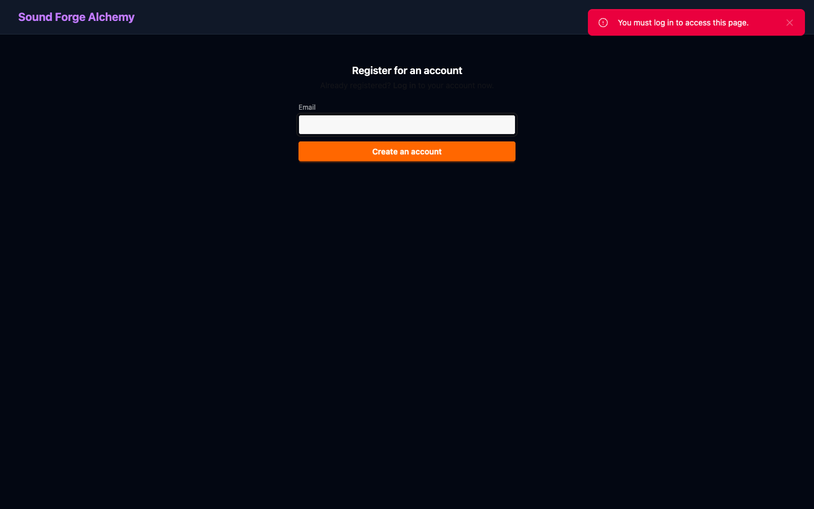

[Home](../index.md) > [Guides](index.md) > Installation

# Installation

Full installation guide for Sound Forge Alchemy including all prerequisites.

## Table of Contents

- [System Requirements](#system-requirements)
- [Install Elixir and Erlang](#install-elixir-and-erlang)
- [Install PostgreSQL](#install-postgresql)
- [Install Node.js](#install-nodejs)
- [Install Python Dependencies](#install-python-dependencies)
- [Clone the Repository](#clone-the-repository)
- [Install Application Dependencies](#install-application-dependencies)
- [Database Setup](#database-setup)
- [Spotify Application Setup](#spotify-application-setup)
- [First Boot Verification](#first-boot-verification)

---

## System Requirements

| Component | Minimum | Recommended |
|-----------|---------|-------------|
| OS | macOS 13, Ubuntu 22.04, Debian 12 | macOS 14, Ubuntu 24.04 |
| CPU | 2 cores | 4+ cores (Demucs uses all available) |
| RAM | 4 GB | 8+ GB (Demucs requires 2–4 GB per job) |
| Disk | 10 GB free | 50+ GB (audio files accumulate) |
| GPU | None | NVIDIA (Demucs 4x faster with CUDA) |
| Elixir | ~> 1.15 | latest |
| Erlang/OTP | 26+ | latest |
| PostgreSQL | 14+ | 16 |
| Python | 3.10+ | 3.12 |
| Node.js | 20+ | 22 |

---

## Install Elixir and Erlang

### macOS (via Homebrew)

```bash
brew install elixir
```

Homebrew installs Erlang/OTP as a dependency.

### Ubuntu/Debian (via asdf)

```bash
# Install asdf
git clone https://github.com/asdf-vm/asdf.git ~/.asdf --branch v0.14.0
echo '. ~/.asdf/asdf.sh' >> ~/.bashrc && source ~/.bashrc

# Add Erlang and Elixir plugins
asdf plugin add erlang
asdf plugin add elixir

# Install versions matching .tool-versions in the repo
cd /path/to/sound-forge-alchemy
asdf install
```

### Verify

```bash
elixir --version
# Elixir 1.17.x (compiled with Erlang/OTP 26)
```

---

## Install PostgreSQL

### macOS

```bash
brew install postgresql@16
brew services start postgresql@16
```

### Ubuntu

```bash
sudo apt install postgresql-16 postgresql-client-16
sudo systemctl start postgresql
```

### Create a database user (if needed)

```bash
sudo -u postgres createuser -s $(whoami)
```

---

## Install Node.js

### macOS

```bash
brew install node@22
```

### nvm (cross-platform)

```bash
nvm install 22
nvm use 22
```

### Verify

```bash
node --version   # v22.x.x
npm --version    # 10.x.x
```

---

## Install Python Dependencies

SFA requires Python 3.10+ with several audio processing libraries:

```bash
# Create a virtual environment (recommended)
python3 -m venv ~/.venv/sfa
source ~/.venv/sfa/bin/activate

# Core audio tools
pip install spotdl librosa soundfile demucs

# Optional: faster librosa on Apple Silicon
pip install llvmlite numba
```

### Verify

```bash
python3 -c "import librosa; print(librosa.__version__)"
spotdl --version
python3 -c "import demucs; print('demucs ok')"
```

### GPU Acceleration for Demucs

If you have an NVIDIA GPU:

```bash
pip install torch torchvision torchaudio --index-url https://download.pytorch.org/whl/cu121
pip install demucs
```

On Apple Silicon, Metal Performance Shaders are used automatically — no extra steps needed.

---

## Clone the Repository

```bash
git clone https://github.com/peguesj/sound-forge-alchemy.git
cd sound-forge-alchemy
```

---

## Install Application Dependencies

```bash
# Fetch Elixir dependencies
mix deps.get

# Install JS dependencies
npm install

# Compile and set up assets
mix assets.setup
mix assets.build
```

---

## Database Setup

```bash
# Create database, run migrations, and seed
mix ecto.setup
```

This executes:
1. `mix ecto.create` — creates `sound_forge_dev`
2. `mix ecto.migrate` — runs all migrations including Oban tables
3. `mix run priv/repo/seeds.exs` — optional seed data

### Reset Database

```bash
mix ecto.reset
```

---

## Spotify Application Setup

SFA needs a Spotify application for OAuth2 client credentials (track metadata only — no user account required for basic functionality).

1. Go to [https://developer.spotify.com/dashboard](https://developer.spotify.com/dashboard)
2. Create a new application
3. Note the **Client ID** and **Client Secret**
4. Add `http://localhost:4000/auth/spotify/callback` to **Redirect URIs**

Create `.env` in the project root:

```bash
SPOTIFY_CLIENT_ID=your_client_id_here
SPOTIFY_CLIENT_SECRET=your_client_secret_here
```

For Spotify user account features (playback in Spotify app), also connect via the Settings page after logging in.


*The Settings page confirms your Spotify connection status (green dot = connected) and shows whether the required audio tools — SpotDL and FFmpeg — are available on the system PATH.*

---

## First Boot Verification

```bash
# Source environment and start
source .env && mix phx.server
```

Expected output:

```
[info] Running SoundForgeWeb.Endpoint with Bandit 1.5.x at 0.0.0.0:4000 (http)
[info] Access SoundForgeWeb.Endpoint at http://localhost:4000
```

Navigate to [http://localhost:4000](http://localhost:4000) and register an account.


*The login page on first visit. Use magic link for passwordless sign-in or the password form if you set a password during registration.*


*New user registration. Enter your email address and click Create an account. A confirmation email will be sent before the account is activated.*

Once logged in, the main dashboard loads your track library.


*A fully loaded library with imported tracks. The sidebar provides access to Library, Playlists, Browse (Artists/Albums), and Studio tools (DAW, DJ, Pads). The Spotify playback bar appears at the bottom once Spotify is connected.*

### Verify Each Subsystem

| Check | URL/Command |
|-------|------------|
| Web app loads | http://localhost:4000 |
| Health endpoint | `curl http://localhost:4000/health` → `{"status":"ok"}` |
| Phoenix LiveDashboard | http://localhost:4000/dev/dashboard |
| Oban running | Check logs for `[Oban] Starting` |

---

## See Also

- [Configuration Reference](configuration.md)
- [Development Setup](development.md)
- [Deployment Guide](deployment.md)

---

[← Quickstart](quickstart.md) | [Next: Configuration →](configuration.md)
